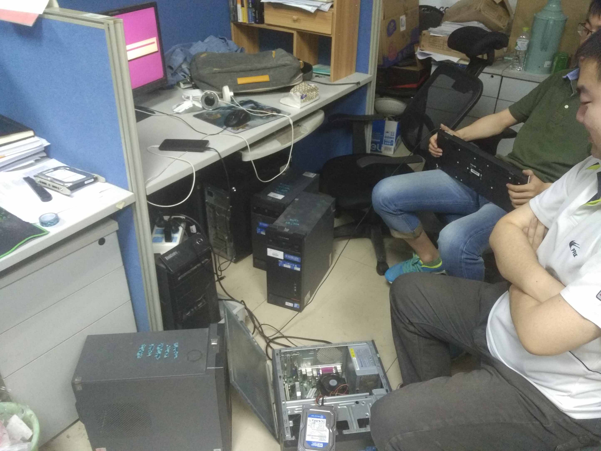

&#160; &#160; &#160; &#160;前些日子，AWS EC2做活动，注册即可免费试用一年，这等好事怎能错过，遂赶紧领了一台，可以上一些和谐的网站，顺便当做我个人的博客。因此这算是我正式写的第一篇博客吧。  
***
&#160; &#160; &#160; &#160;大概在三个月前过年回家的时候，偶然看到了前阿里大牛李智慧的《大型网站技术架构-核心原理与案例分析》，作为一个技术noob，内心除了翻滚的敬仰之情，更多的带给我的是向往，淘宝这种日均亿级别PV的网站是如何实现的。    
&#160; &#160; &#160; &#160;我也写了半年后台，用的是LNMP，但对系统性能调优方面一无所知，服务器正常运作的并发量也就在几百左右，现在才深知与这个行业最牛X的那群工程师们的差距。但我认为，永远不要畏惧新的事物，这是一个程序猿最重要的品质，如果你惧怕它，觉得接触新的东西可能要花一段时间去适应它，但问题就是计算机这个日新月异的行业，你只有永远站在浪尖上，哪怕是追随，才能保证自己不被淘汰。所以我认为以android studio不好用，不习惯，教程少等为借口而继续用eclipse开发android的人，不具备一个程序员的基本素质。   

&#160; &#160; &#160; &#160;扯远了，回到正题，前些阵子由于各种杂事，好一阵忙。看《大型网站技术架构》时的一腔激情也正在慢慢消磨，我意识到一定要尽快开始本小白的架构之路了，但我意识到以我一个人的精力，能力，要独立搭一个像模像样的网站架构，可能有些虚。果断邀请了三个同学：海哥、Master韩，小聪来一起做，出乎意料的是我找他们谈的时候，他们都展示出了极大的兴趣。  

&#160; &#160; &#160; &#160;Let‘s Begin！ 

&#160; &#160; &#160; &#160;做这东西，需要服务器啊怎么办，本来为这事正发愁的时候，到实验室一看，OMG，墙角居然有一堆退槽的主机。真是天助我也，话多不说，当晚就开始。可恨的是这些主机大部分都不能直接用，不是硬盘坏了就是其他问题，没办法，只能东凑凑，西拼拼，鼓鼓捣捣一直到第二天凌晨3点半，居然凑出了6台能用的主机，都给“他”们清一色地上了ubuntu-server-14.04.4。（注意用词，没用它，因为他们都有一个响亮的名字，大娃、二娃、三娃、四娃、五娃，六娃，可惜的是七娃的系统就是装不上去，难道是跟ubuntu一个色，冲突了？哈哈！） 来一张图：  

 这也算正式开始了我们几个小白的架构之路！  
 