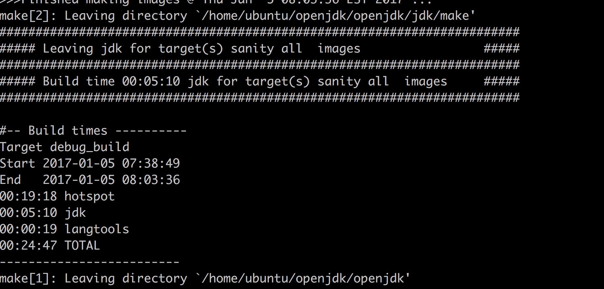
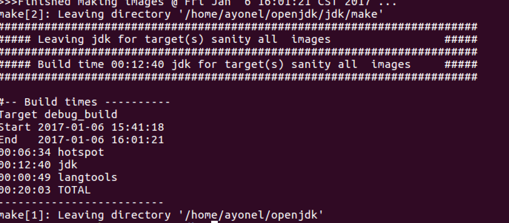

&#160; &#160; &#160; &#160;最近在看周志明的《深入理解Java虚拟机-JVM高级特性与最佳实战》，要学习JVM，最好还是自己先能编译一遍。书中给出了在Mac上编译openjdk7的教程，但距离今天太过久远，书中的方法并不能奏效。只能自己上网一点点来了。
&#160; &#160; &#160; &#160;最开始打算是在我的Mac上编译，我的OSX系统是macOS sierra（10.12.2），从此我算是开始了噩梦般的一天。各种网上有的，或者没有的Error简直把我折磨得要奔溃。期间光JDK都不知道装了多少个，现在想起来还是心累。正好我桌子底下还有一台机子装着ubuntu14.04，那索性就弃了Unix的坑，用Linux来编译吧。
&#160; &#160; &#160; &#160;总得来说在Linux上编译，还是十分顺利的，总共遇见了2个Error（Mac上光解决的都不止10个，后来实在是心累不想再耗下去了）出现的Error网上都有解决方法。下面就简单说一下步骤吧。
1. 下载要将要编译的openjdk，我选择的版本是openjdk-7u40-fcs-src-b43-26\_aug\_2013.zip,下载地址为[https://jdk7.java.net/source.html](https://jdk7.java.net/source.html)
2. 因为JDK中有很多代码是Java自身实现的，所以还需要一个已经安装在本机上可用的JDK，叫做“Bootstrap JDK”。我所选用的Bootstarp JDK是JDK1.6.0_45 
```bash
java version "1.6.0_45"
Java(TM) SE Runtime Environment (build 1.6.0_45-b06)
Java HotSpot(TM) Server VM (build 20.45-b01, mixed mode)
```
3. 安装编译前的依赖环境
```bash
安装gcc、g++、make等  
sudo apt-get install build-essential      
安装ant 1.7以上  
sudo apt-get install ant  
安装XRender  
sudo apt-get install libxrender-dev  
sudo apt-get install xorg-dev  
安装alsa  
sudo apt-get install libasound2-dev
Cups  
sudo apt-get install libcups2-dev  
安装零碎的工具包  
sudo apt-get install gawk zip libxtst-dev libxi-dev libxt-dev
```
4. 配置编译脚本 
将你的openjdk解压后，并进入该文件夹。比如我的是在/home/ubuntu/openjdk下。 新建一个build.sh，并添加如下内容：
```bash
export LANG=C
#将一下两项设置为你的BootstrapJDK安装目录
export ALT_BOOTDIR=/usr/java/jdk1.6.0_45
export ALT_JDK_IMPORT_PATH=/usr/java/jdk1.6.0_45
#允许自动下载依赖包
export ALLOW_DOWNLOADS=true

#使用预编译头文件，以提升便以速度
export USE_PRECOMPILED_HEADER=true

#要编译的内容，我只选择了LANGTOOLS、HOTSPOT以及JDK
export BUILD_LANGTOOLS=true
export BUILD_JAXP=false
export BUILD_JAXWS=false
export BUILD_CORBA=false
export BUILD_HOSTPOT=true
export BUILD_JDK=true

#要编译的版本
export SKIP_DEBUG_BUILD=false
export SKIP_FASTDEBUG_BUILD=true
export DEBUG_NAME=debug

#避免javaws和浏览器Java插件等的build
BUILD_DEPLOY=false

#不build安装包
BUILD_INSTALL=false

#设置存放编译结果的目录
export ALT_OUTPUTDIR=/home/ubuntu/openjdk/openjdk/build

unset CLASSPATH
unset JAVA_HOME
make sanity
DEBUG_BINARIES=true make 2>&1 | tee $ALT_OUTPUTDIR/build.log
```
5. 开始编译 在openjdk目录下，运行build.sh
```bash
chmod +x build.sh
./build.sh
```
&#160; &#160; &#160; &#160;由于我的机子比较旧，编译用了将近25分钟。最后如果出现如下图所示，祝贺你，终于成功了。 
&#160; &#160; &#160; &#160;进入生成build/j2re-image/bin下，执行
`./java -version` 
&#160; &#160; &#160; &#160;****输出的java版本信息将是带着你的机器用户名，我用的是root用户，所以输出了：
```bash
openjdk version "1.7.0-internal-debug"
OpenJDK Runtime Environment (build 1.7.0-internal-debug-root_2017_01_05_07_34-b00)
OpenJDK Server VM (build 24.0-b56-jvmg, mixed mode)
```
&#160; &#160; &#160; &#160;总算是迈出了真正的第一步。不得不佩服那些大牛超常的智慧，一个JDK我们编译都感到如此庞大复杂，他们居然用一行行代码敲出来！！orz---- PS:linux上确实要好编译，我在ubuntu16.04 64位上也很快顺利完成了。 