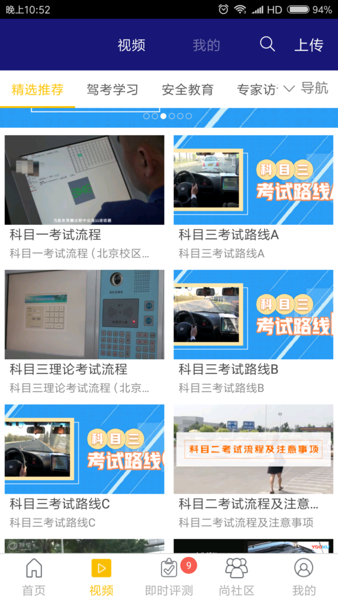
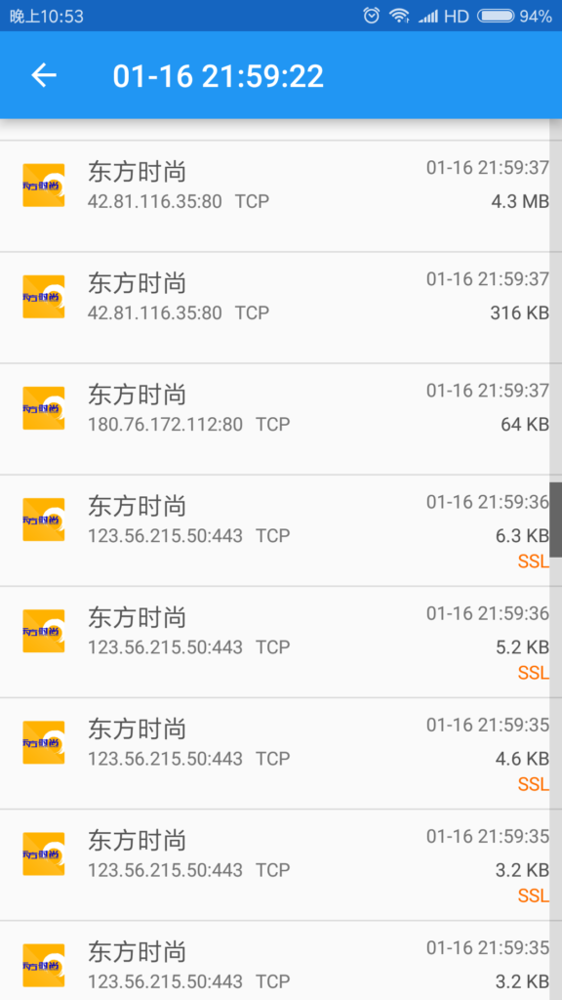
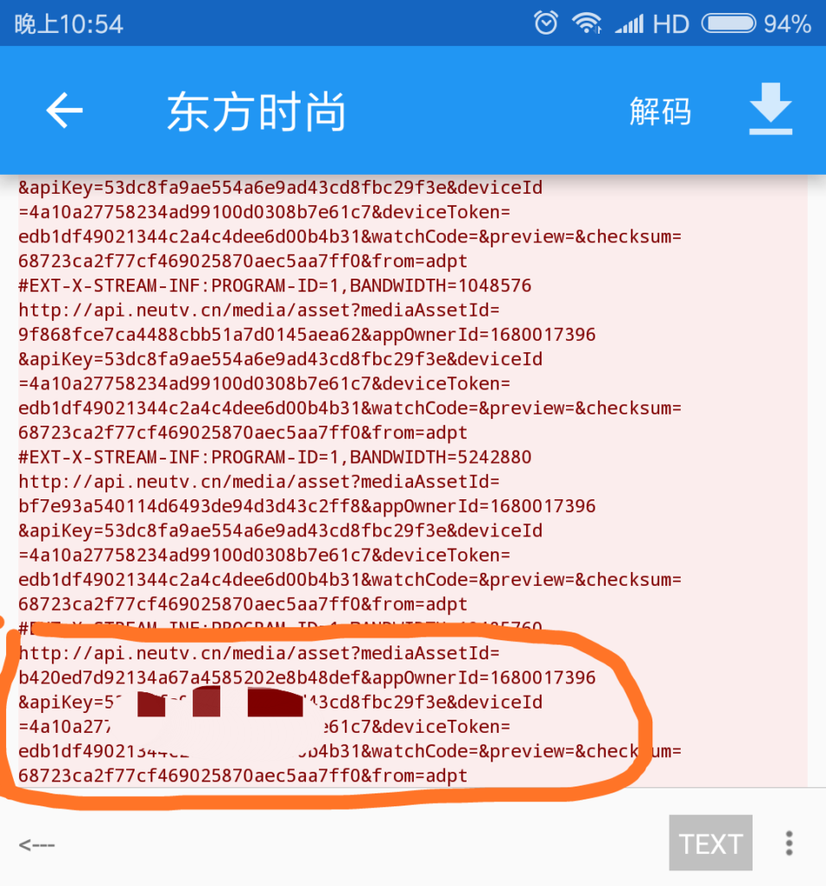
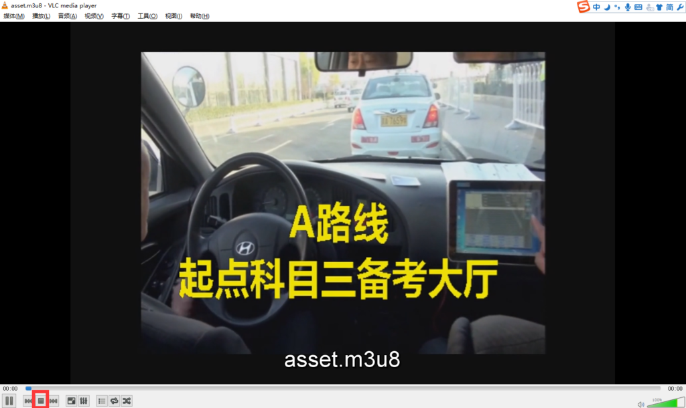
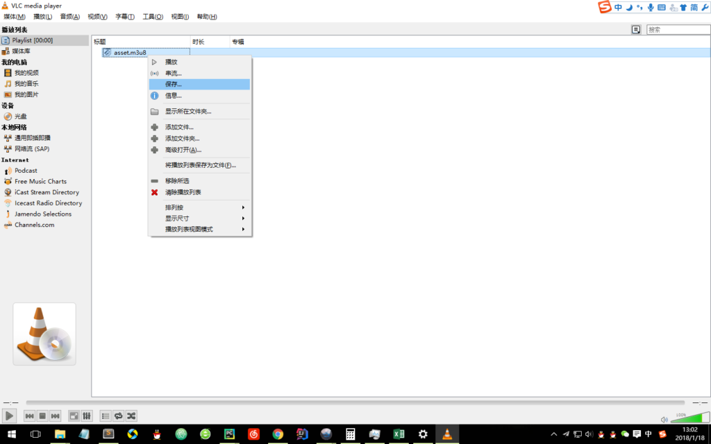

&#160; &#160; &#160; &#160;近期打算去把搁置一年多的驾照去考了，听说最近北京驾照改革，拿本难度升级了不少，希望好运！   
&#160; &#160; &#160; &#160;东方时尚的科目三考试路线总共分为A,B,C三段，A+B+C就是绕东方时尚校区的一个闭环路线。但是由于平时考试路线都不允许训练车辆驶入，因此科目三考前，每个学员顶多跑1-2圈，而我认为科三的考试最重要的就是熟悉线路，明白在哪儿需要变道，在哪儿是公交车站、学校需要减速，其余就是仔细听语音播报，不要慌乱即可。
&#160; &#160; &#160; &#160;既然我们在实际考试路线上的训练时间非常少，因此我们需要多去看看东方时尚APP提供的三段路线的考试视频，达到熟记路线的目的。然而东方时尚APP内嵌的考试视频我们无法直接下载，每次打开都需要耗费流量下载（每段视频都在100M以上，很费流量）因此我们需要特殊的技巧将视频下载下来，这样可以在去驾校的班车上复习路线，具体操作如下：
1. 我们需要使用手机端抓包软件获取视频的真实地址，我们使用 [packet capture](http://www.5577.com/s/134884.html) 这款抓包软件，  首先下载安装packet capture。
2. 关闭所有应用(避免流量干扰)，然后打开packet capture, 再打开东方时尚APP，点击视频tab，就会出现我们需要的视频展示页面，点击“科目三考试路线A”，直到开始播放视频。  
3. 切回packet capture，它已经捕获这段时间内我们手机应用的所有网络请求。点进去，会出现具体的每个请求的信息。如下图所示：  
&#160; &#160; &#160; &#160;我们逐个点击带东方时尚APP logo的包，直到看到有个类似视频地址的链接。如下图圈出部分： 
&#160; &#160; &#160; &#160;至此，我们已经拿到了视频的真实地址，并且可以看出视频是托管在[nuetv](http://www.neutv.cn)上，该视频肯定是私有视频，因此视频链接中带有apikey以及deviceId等参数。 我们在浏览器中打开这个链接，会下载下来一个.m3u8的文件，关于m3u8文件格式，可自行google，总之这个文件就是我们真正想要的视频的描述信息，我们可以用常用的视频播放器打开此文件，将会正常播放视频，只不过数据都需要在线加载。 接下来我们的任务变成通过这个m3u8文件下载到真实视频。通过google我找到一个视频播放器[VLC](http://rj.baidu.com/soft/detail/12124.html?ald)，首先下载安装VLC。 用VLC打开我们下载的m3u8文件，VLC也会自动播放视频，我们需要点击视频左下角的方块按钮（图中已圈出） 之后我们在播放列表中能看到该文件，我们右键保存到想要的位置就可以了。  为了方便，我已经视频上传至了百度云，有需要的同学可以自行下载。
***
&#160; &#160; &#160; &#160;链接: [https://pan.baidu.com/s/1ggFUGuf](https://pan.baidu.com/s/1ggFUGuf) 密码: mazw