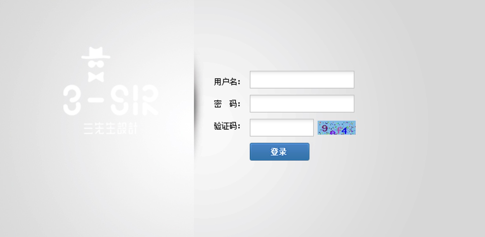
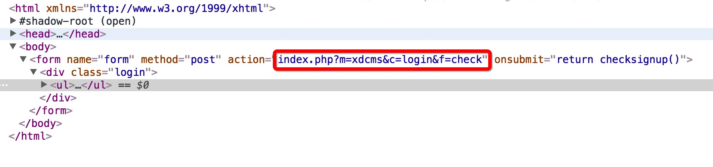
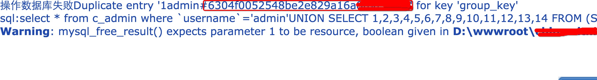

&#160; &#160; &#160; &#160;我相信每个程序员心里都有一个黑客梦，我也不例外。本科四年，舍友[malash大神](http://malash.me)天天遨游在学校的各种服务器之间，xss,sql注入，shell提权信手拈来，请允许我再次献上我的膝盖。 好了，废话不多说。最近再看一些web安全相关的东东，对sql注入的原理也有了更为深刻的理解，但纸上得来终觉浅，我的四十米大刀早已饥渴难耐了。

> **0x00 寻找猎物** 

其实这个猎物我心里早就有了，这次就是拿他来练手。鉴于和谐原因，暂不公布目标。
> **0x01 先来点小测试** 

本来还想先从找出管理员登录页面开始，都已经下好了路径扫描工具。但是当时耶稣的光芒照亮了我，手抖了一下，在目标域名后接了个‘/admin’,就直接跳转到管理员登录页面了，无语。。。。 
 
这一下就令偶信心大增，有简单测了一下，验证码是挂了，多次提交验证码不会刷新，这简直是爽的不要不要啊。并且对管理员用户名的正确与否还有提示，简直了。。。 
输入错误的管理员用户名，会提示:
 
在管理员处输入admin,则提示：
 
这后台还真是贴心啊。 

> **0x02 burpsuite登场**

到这，验证码是挂的，又知道用户名，就唯独差一个密码了。用burpsuite神器截包并暴力破解，大约跑了2个多小时，基本的常见的字典都跑完了，还是没跑出来。我知道这条路现在是行不通了。看来得换一下思路。
 
> **0x03 找出后台框架** 
 
邮件审查了一下管理员登录页面的源码，
 表单提交模块名是xdcms，大概百度了一下，这是一个php写的cms，在我大乌云(天佑我乌云, 世纪佳缘不要碧莲)上找了一番，这框架简直惨不忍睹啊，翻了几页都没翻完。 

> **0x04 Sql注入** 

逐个试了好几个漏洞，终于找见了一个能用的。直接上代码： 用户名输入： 

```bash
admin' UNION SELECT 1,2,3,4,5,6,7,8,9,10,11,12,13,14 
    FROM (SELECT count(1),concat(round(rand(0)),(SELECT concat(username,0×23,password) 
        FROM c_admin LIMIT 0,1))a FROM information_schema.tables GROUP 
            by a)b# 
```         

密码随意填，写上验证码，点击登录： 
 
可以看到已经爆出了加密的管理员密码，这个密码是两层md5加密。 

> **0x05 万能的淘宝** 

cmd5上解那个md5串没解出来，还是万能的淘宝给力，这儿就不给广告了。进去之后，也没啥好看的，还是为了和谐，就不放图了，大家自行脑补。 

> **0x06 总结** 

第一次黑网站，心情还是很激动的。也踩了很多坑，要是早知道用的xdcms，直接来乌云就可以了，还费了一些时间学习burpsuite.其实好多网站漏洞一大堆，在我来之前说不定早有人已经踩过点了。。 在登陆成功的一刹那，还是很有成就感的。这条路好长，且行且珍惜。