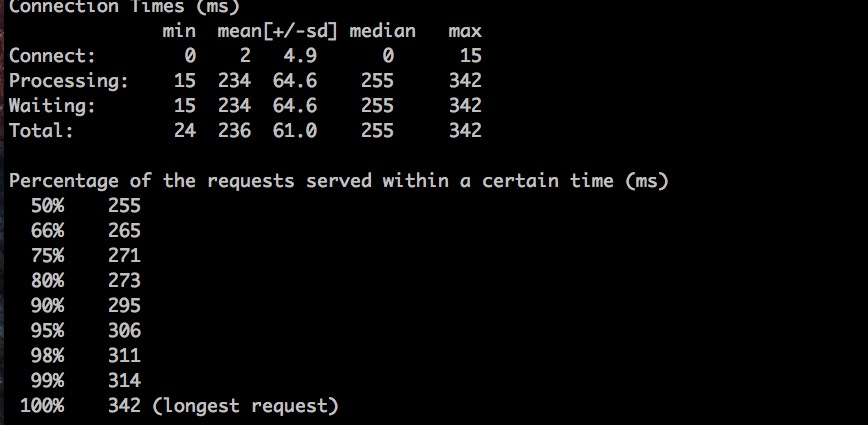
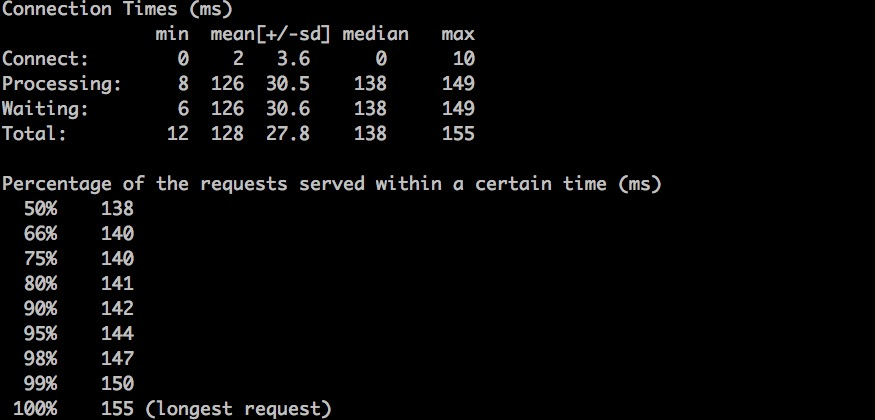

&#160; &#160; &#160; &#160;今天打算好好测一下我们的哒哒相机APP (友情广告一波,[下载链接](http://dada.dimeratech.com))的后台性能。目前哒哒相机APP只用了一台阿里云ECS(1核CPU、2G内存~~). 为了开发测试, 又买了一台用作测试服务器(1核CPU、1G内存). 后台环境为ubuntu14.04、nginx 1.4、mysql 5.6 以及php5.6.
&#160; &#160; &#160; &#160;用ab分别在正式服务器和测试服务器对同一个php文件进行读取，发现在同等压力下测试服务器的速度就是要比正式服务器高。这可就郁闷死我了，你说一样的配置，正式服务器还比测试服务器多了一倍内存，为毛并发还比不上测试服务器？这一整天就耗在这个问题上了。
&#160; &#160; &#160; &#160;刚开始我以为是PHP配置的问题，对比了两台服务器的PHP配置项，关于cache以及memory的都一样啊，为了排除是否是PHP的原因，我将测试PHP文件换为了一张4KB的图片，继续AB： 
这是正式服务器100并发结果，如下：  
这是测试服务器100并发结果，如下： 
可以看到测试服务器响应速度还是要明显高于正式服务器（多次换文件测试，速度大概高1/3），这就排除了是PHP的问题；那就只有nginx了。又反复查看了两台nginx的配置文件，也是一样，期间还做了很多乱七八糟的测试，还是没能找出原因。 

这时我突然意识到会不会是硬件的问题，两台服务器都是阿里云，但是买的时候先买了正式服务器，最近才买的这个测试服务器。虽然买的时候都选的同样的配置，但是阿里云屏蔽了很多硬件细节的东西，只告诉你CPU要几核，内存要多大。。。

> 1. 先测两者的硬盘读写速率，我用的是hdpram，需要先安装. 

命令为：`>hdparm -tT /dev/xvda`
正式服务器为：
 ```
/dev/xvda:
Timing cached reads: 15612 MB in 1.99 seconds = 7845.40 MB/sec
Timing buffered disk reads: 238 MB in 3.02 seconds = 78.92 MB/sec 
```

测试服务器为：
 ```/
/dev/xvda:
Timing cached reads: 17848 MB in 2.00 seconds = 8932.35 MB/sec
Timing buffered disk reads: 240 MB in 3.00 seconds = 79.90 MB/sec
```
  以上结果测试了多遍，均显示测试服务器磁盘的读速率要比正式服务器磁盘高出14%，两者的写差不多。到这我还是不太相信两台服务器并发量的差别完全是由磁盘导致的。
  
> 2. 我又查看了两者的CPU 信息，命令: `cat /proc/cpuinfo`
 
正式服务器结果为：
 ```
processor : 0
vendor_id : GenuineIntel
cpu family : 6
model : 45
model name : Intel(R) Xeon(R) CPU E5-2630 0 @ 2.30GHz(型号)
stepping : 7
microcode : 0x70d
cpu MHz : 2300.102（频率）
cache size : 15360 KB(缓存大小)
physical id : 0
siblings : 1
core id : 0
cpu cores : 1
apicid : 0
initial apicid : 0
fpu : yes
fpu_exception : yes
cpuid level : 13
wp : yes
flags : fpu vme de pse tsc msr pae mce cx8 apic sep mtrr pge mca cmov pat clflush mmx fxsr sse sse2 ht syscall nx rdtscp lm constant_tsc rep_good nopl pni ssse3 cx16 sse4_1 sse4_2 popcnt aes hypervisor lahf_lm
bogomips : 4600.20
clflush size : 64
cache_alignment : 64
address sizes : 46 bits physical, 48 bits virtual
```
测试服务器结果为：
```
processor : 0
vendor_id : GenuineIntel
cpu family : 6
model : 62
model name : Intel(R) Xeon(R) CPU E5-2650 v2 @ 2.60GHz（CPU型号）
stepping : 4
microcode : 0x428
cpu MHz : 2593.838（频率）
cache size : 20480 KB（缓存大小）
physical id : 0
siblings : 1
core id : 0
cpu cores : 1
apicid : 0
initial apicid : 0
fpu : yes
fpu_exception : yes
cpuid level : 13
wp : yes
flags : fpu vme de pse tsc msr pae mce cx8 apic sep mtrr pge mca cmov pat clflush mmx fxsr sse sse2 ht syscall nx rdtscp lm constant_tsc rep_good nopl pni ssse3 cx16 sse4_1 sse4_2 popcnt aes hypervisor lahf_lm
bogomips : 5187.67
clflush size : 64
cache_alignment : 64
address sizes : 46 bits physical, 48 bits virtual
``` 
&#160; &#160; &#160; &#160;可以看出测试服务器CPU为2.6GHz，要比正式服务的2.3GHz要高不少，另外CPU缓存也高出了1/3.到这，我基本确定了，不是PHP的问题，不是nginx的问题，是阿里云不同时间段买的ECS底层配置根本不一样，虽然用户购买的时候都选的同样的核心数，多样大的磁盘，但是它的硬件已经升级了（自来水一波：阿里云还是相当不错的）。
一天的时间就耗费在这儿了，不过挺开森~~~特此MARK