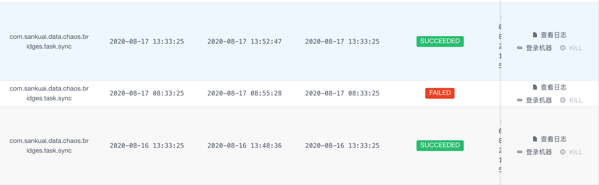
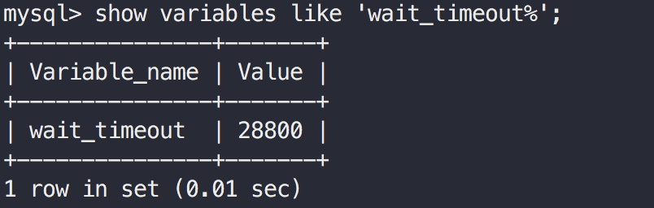
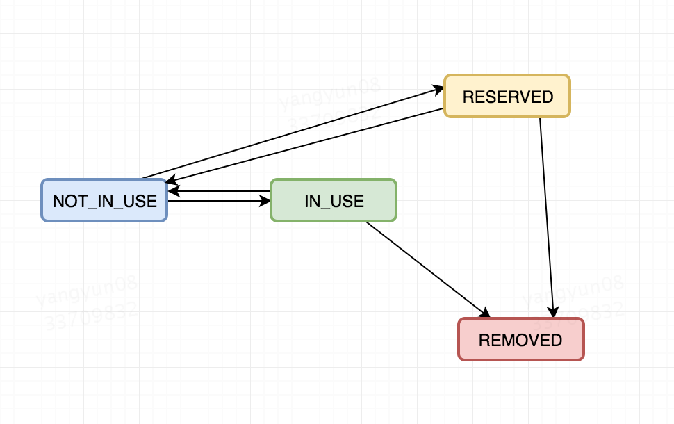
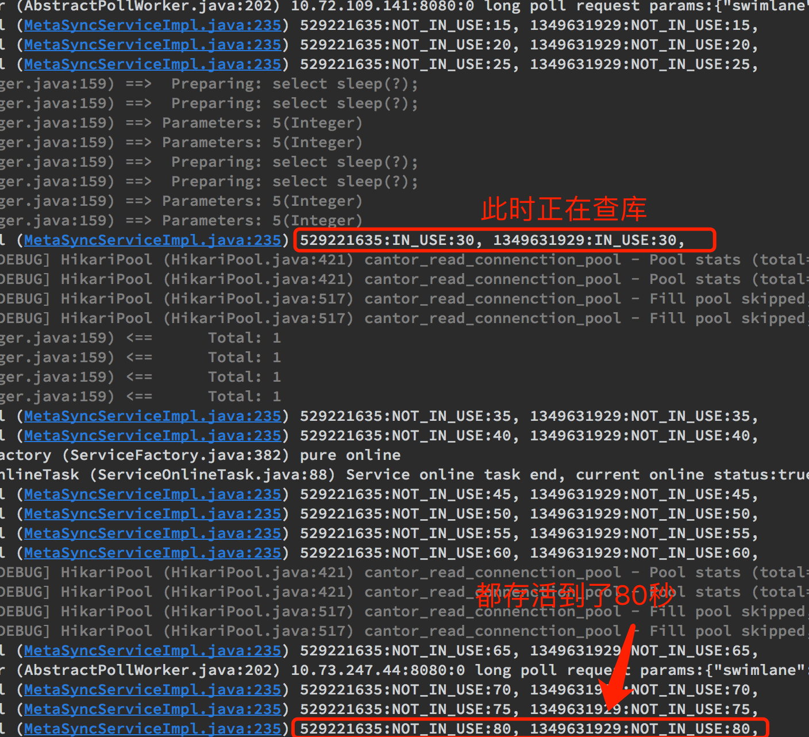

# 背景
近日突然收到一条服务告警消息，我们的一个Crane任务执行失败。

> Crane: 美团分布式任务调度中间件，支持分布式定时任务调度。可以理解为一个功能更强大的、分布式版的[Quartz](https://github.com/quartz-scheduler/quartz)



通过查看日志得出，报错是因为 该任务执行过程中的一次查库操作发生了异常。具体异常为`Caused by: com.mysql.jdbc.exceptions.jdbc4.MySQLNonTransientConnectionException: No operations allowed after connection closed.`
由于完整异常堆栈过长，截取异常堆栈中最关键的部分，如下所示：
```$java
at org.springframework.jdbc.datasource.DataSourceUtils.getConnection(DataSourceUtils.java:77)
... 56 more
Caused by: com.mysql.jdbc.exceptions.jdbc4.MySQLNonTransientConnectionException: No operations allowed after connection closed.
at sun.reflect.GeneratedConstructorAccessor276.newInstance(Unknown Source)
at sun.reflect.DelegatingConstructorAccessorImpl.newInstance(DelegatingConstructorAccessorImpl.java:45)
at java.lang.reflect.Constructor.newInstance(Constructor.java:422)
at com.mysql.jdbc.Util.handleNewInstance(Util.java:425)
at com.mysql.jdbc.Util.getInstance(Util.java:408)
at com.mysql.jdbc.SQLError.createSQLException(SQLError.java:919)
at com.mysql.jdbc.SQLError.createSQLException(SQLError.java:898)
at com.mysql.jdbc.SQLError.createSQLException(SQLError.java:887)
at com.mysql.jdbc.SQLError.createSQLException(SQLError.java:861)
at com.mysql.jdbc.ConnectionImpl.throwConnectionClosedException(ConnectionImpl.java:1184)
at com.mysql.jdbc.ConnectionImpl.checkClosed(ConnectionImpl.java:1179)
at com.zaxxer.hikari.pool.PoolBase.setNetworkTimeout(PoolBase.java:560)
at com.zaxxer.hikari.pool.PoolBase.isConnectionAlive(PoolBase.java:173)
at com.zaxxer.hikari.pool.HikariPool.getConnection(HikariPool.java:186)
... 60 more
```

# 问题分析
通过异常日志`No operations allowed after connection closed.`可以看出来这是一个典型的获取到失活数据库连接导致的问题。<br>
这个问题直白地说就是应用程序从连接池拿到了一个已经dead(失活)的连接，但应用程序并不知道，继续正常利用此连接进行操作，那么就会抛出该异常。 <br>
那为什么会获取到失活连接呢？这需要从MySQL本身说起。<br>
我们都知道，对于MySQL而言，连接是很宝贵的资源。虽然我们可以通过搭建MySQL主从集群来**水平扩展读能力**（增加N台从库，意味着可以支持更多的连接，从而提供更高的读吞吐）。但对于写操作或者事务中的读操作仍然是在主库这个单点进行。意味着写操作无法进行水平扩展，其吞吐依然受制于主库的连接能力。<br>
这也是为什么需要各种同城双活、异地多活、单元化（Set化）架构的原因。这些架构不止提升了服务的可靠性（一旦地域或单元发生故障，可以自动将流量切到其他地域或单元，保证服务不受影响），更能提供多点写入能力，意味着写操作不再受制于单个主库的可支持的最大连接数限制，集群的**写能力也进行了水平扩展**。
> 多点写入会引来一致性问题，需要专用的数据同步组件来进行跨地域或单元的数据同步，保证数据一致性，其底层会涉及到很多细节，美团使用公司自研的DTS组件来进行Set之间的数据同步。

既然MySQL的连接很宝贵，如果一个客户端连接上MySQL，但是长时间不进行任何读写，白白浪费了这个连接（这就是典型的占着茅坑不拉屎，MySQL单点可支持连接数是有上限的），MySQL会将超过一定时间的空闲连接主动关闭，以清理出资源支持其他活跃连接。在MySQL中有一个参数`wait_timeout`，用来指定Mysql关闭**非交互空闲连接**之前秒数。
我们可以执行`show variables like 'wait_timeout%'`来查看该参数。


从图中可以看出我们的MySQL该参数值为默认值28800秒，即8小时。意味着如果一个连接已经空闲了超过8小时，MySQL会主动关闭该连接。但此时客户端并不会感知到连接的不可用，如果继续使用该失活连接，就会报出`No operations allowed after connection closed.`

# 连接池的保活机制-keepalive
一般我们都会使用数据库连接池来进行连接的管理，如druid，c3p0, hikari或者tomcat-jdbc等等。那么对于失活连接的检测以及剔除就需要这些连接池来帮我们做。<br>
比如对于druid，会提供以下几个参数来处理该问题：
+ **testOnBorrow=true** : 从连接池获取连接时，进行探活。该参数为true，保证从连接池中拿到的连接都是有效的，但会很消耗性能（线上服务不推荐开启）。其一般做法为获取连接时执行一个testQuery（比如`select 1`）,如果可以执行成功，则代表连接有效。
+ **testWhileIdle=true** : 只对空闲连接进行探活检测，需要timeBetweenEvictionRunsMillis配合，
+ **timeBetweenEvictionRunsMillis=30000** : 该参数指定对空闲连接进行检测的间隔，如此配置代表30进行一轮检测。一般检测到一个空闲连接失活后，会剔除出连接池，保证业务进程获取到的都有有效连接。

我们使用的是[HikariCP](https://github.com/brettwooldridge/HikariCP)连接池。这是一个高性能、轻量的数据库连接池，正如其名字一样（hikari在日文中是`光`的意思）。Springboot 2.0以后已经将hikari作为默认的连接池实现，证明该连接池确实很牛逼，未来发展也是十分看好。<br>
hikari为什么快呢？这里贴一下[网上别人总结的几条](https://www.jianshu.com/p/dd0c2b0ed202)：
+ 使用Javassist优化并精简字节码
+ ConcurrentBag: 更好的并发集合类实现
+ 使用自定义的FastList替代ArrayList

> 目前国内可能使用更多的连接池是druid，关于druid与hikari的性能对比，hikari作者给出了一个benchmark, druid作者温少也参与了评论：https://github.com/brettwooldridge/HikariCP/issues/232。 

那hikari如何解决失活连接探测问题呢？需要以下两个参数控制：
+ **maxLifetime**:
> This property controls the maximum lifetime of a connection in the pool. An in-use connection will never be retired, only when it is closed will it then be removed. On a connection-by-connection basis, minor negative attenuation is applied to avoid mass-extinction in the pool. We strongly recommend setting this value, and it should be several seconds shorter than any database or infrastructure imposed connection time limit. A value of 0 indicates no maximum lifetime (infinite lifetime), subject of course to the idleTimeout setting. The minimum allowed value is 30000ms (30 seconds). Default: 1800000 (30 minutes)

这个参数控制了连接在hikari中的最长存活时间（**这句话存疑，本例case就是一个活生生的反例**）。hikari强烈建议设置该值，该值需要比数据库或者**基础设施（划重点）**的（空闲）连接时间限制要短一点。默认值30分钟。
+ **idleTimeout**
> This property controls the maximum amount of time that a connection is allowed to sit idle in the pool. This setting only applies when minimumIdle is defined to be less than maximumPoolSize. Idle connections will not be retired once the pool reaches minimumIdle connections. Whether a connection is retired as idle or not is subject to a maximum variation of +30 seconds, and average variation of +15 seconds. A connection will never be retired as idle before this timeout. A value of 0 means that idle connections are never removed from the pool. The minimum allowed value is 10000ms (10 seconds). Default: 600000 (10 minutes)

这个参数控制了一个**空闲连接**能够在hikari中能够存活的最长时间，只有当`minimumIdle`比`maxiumnPoolSize`小时，才会生效。最小值10秒，默认值10分钟。

# 配置分析
了解了hikari的连接保活机制，我们再来看下线上的参数配置，看是不是由于参数设置不合理引发。我们的线上配置如下：
```
    jdbcUrl: jdbc:mysql://data-mysql-cantor-read.***.***:5002/cantor?useUnicode=true&characterEncoding=utf-8&useSSL=false
    # hikari配置中的所有时间单位均为毫秒, 具体可参考：https://github.com/brettwooldridge/HikariCP
    type: com.zaxxer.hikari.HikariDataSource
    # 连接获取超时时间
    connectionTimeout: 10000
    # 连接最大生命周期: 半小时，保证比wait_timeout小即可。线上cantor库的wait_timeout=8小时
    maxLifetime: 1800000
    # minIdle以外的空闲连接存活时间，半小时
    idleTimeout: 1800000
    # 最小空闲连接数量
    minimumIdle: 2
    # 最大连接数量，默认为10
    maximumPoolSize: 10
    poolName: cantor_read_connenction_pool
```
可以看出连接的最大生命周期为半小时，且空闲连接也是半小时会检测一轮。这远小于线上MySQL的配置（8小时），那为什么会获取失活连接呢？ <br>
我摸摸我可爱的小头，顿时觉得此事不简单~ <br>
经过咨询DBA，提供了一个重要线索：从配置中可以看出，我们使用的是vip域名进行连接。而一旦使用域名进行连接，意味着客户端与MySQL的请求并不是直连，而需要经过美团的四层负载均衡MGW, MGW对空闲连接也有类似的超时主动关闭机制。经过咨询SRE同事，得出我们所使用的MGW超时时间为**3500秒**（可以，已经比8小时缩短了很多，排查出问题的原因胜利在望）。<br>
这时候回想hikari文档中对于`maxLifetime`的介绍：should be several seconds shorter than any database or **infrastructure** imposed connection time limit，这个**infrastructure**在我们的case中就是指MGW,该参数并不仅仅只受数据库的限制，还需要依赖基础网络设施限制，hikari作者这老头子还是经验老道啊。
> MGW（Meituan Gateway）是一个基于DPDK开发的四层负载均衡网关（LVS有类似的功能）并做了额外的功能定制，其特点是高性能，高稳定。

> 这里解释一下我们会什么采用jdbcUrl这种类似直连的方式，并没有使用公司内部统一的数据库中间件。
> 本文中出现的这个数据源并不是我们本身的业务数据源，而是另一个服务的数据源，由于历史原因，一直使用域名这种方式直接查询该服务的一些数据。
> 其实这种db层面的耦合是一个很不好的设计。并且使用数据库时，最好使用公司的统一数据库中间件，比如我们的主业务使用[zebra](https://github.com/Meituan-Dianping/Zebra)
> 使用数据中间件能带来诸多好处，如自动读写分离，透明分库分表，有统一的监控可以合入公司内部统一的服务治理体系，更重要的是对DBA友好~ 比如接入了zebra之后，DBA可以按语句进行流量拦截操作，这个功能是十分重要的。

虽然经过我们的一番排查，空闲连接实际存活不会超过3500秒，但我们明明配置的连接生命周期是1800秒，空闲连接探活周期也是1800秒，那为什么还是会出现拿到失活连接的问题呢？<br>
这个问题我们只能从源码中去寻找答案。

# hikari 源码分析

## idleTimeout原理解析
我们先来看看hikari如何进行空闲连接的探活，也即`idleTimeout`是怎么生效的。在`com.zaxxer.hikari.pool.HikariPool`中的`HouseKeeper`(翻译:管家)任务类，
该任务类由一个定时调度线程池进行周期性调度，默认每30秒执行一次。

```$java
   //**
    * HouseKeeper这个任务类用来回收空闲连接，并保持连接数不少于minimunIdle参数
    * The house keeping task to retire and maintain minimum idle connections.
    */
   // 
   private final class HouseKeeper implements Runnable
   {
      private volatile long previous = plusMillis(currentTime(), -housekeepingPeriodMs);

      @Override
      public void run()
      {
         try {
            // refresh values in case they changed via MBean
            connectionTimeout = config.getConnectionTimeout();
            validationTimeout = config.getValidationTimeout();
            leakTaskFactory.updateLeakDetectionThreshold(config.getLeakDetectionThreshold());
            catalog = (config.getCatalog() != null && !config.getCatalog().equals(catalog)) ? config.getCatalog() : catalog;

            final long idleTimeout = config.getIdleTimeout();
            final long now = currentTime();

            // 处理时钟回退问题
            // Detect retrograde time, allowing +128ms as per NTP spec.
            if (plusMillis(now, 128) < plusMillis(previous, housekeepingPeriodMs)) {
               logger.warn("{} - Retrograde clock change detected (housekeeper delta={}), soft-evicting connections from pool.",
                           poolName, elapsedDisplayString(previous, now));
               previous = now;
               softEvictConnections();
               return;
            }
            else if (now > plusMillis(previous, (3 * housekeepingPeriodMs) / 2)) {
               // No point evicting for forward clock motion, this merely accelerates connection retirement anyway
               logger.warn("{} - Thread starvation or clock leap detected (housekeeper delta={}).", poolName, elapsedDisplayString(previous, now));
            }

            previous = now;

            String afterPrefix = "Pool ";
            // 关键判断条件，如果idleTimeout参数大于0，且minimumIdle < maximumPoolSize，则进行空闲连接回收
            if (idleTimeout > 0L && config.getMinimumIdle() < config.getMaximumPoolSize()) {
               logPoolState("Before cleanup ");
               afterPrefix = "After cleanup  ";

               final List<PoolEntry> notInUse = connectionBag.values(STATE_NOT_IN_USE);
               // 判断最多需要移除几个连接
               int toRemove = notInUse.size() - config.getMinimumIdle();
               for (PoolEntry entry : notInUse) {
                  // 如果连接的上次使用时间距今是否已经过去了idleTimeout
                  if (toRemove > 0 && elapsedMillis(entry.lastAccessed, now) > idleTimeout && connectionBag.reserve(entry)) {
                     // 关闭连接
                     closeConnection(entry, "(connection has passed idleTimeout)");
                     toRemove--;
                  }
               }
            }
            // 记录日志
            logPoolState(afterPrefix);

            // 填充连接池，维持最小连接数
            fillPool(); // Try to maintain minimum connections
         }
         catch (Exception e) {
            logger.error("Unexpected exception in housekeeping task", e);
         }
      }
   }
```


从上述代码我们可以得出2个关键信息：
+ **只有 `idleTimeout > 0` 才会进行空闲连接回收**
+ **只有 `minimumIdle < maximumPoolSize`才会进行空闲连接回收**
这两个结论很重要，请记住，下文会用到。

## maxLifetime原理解析
我们接着来看`maxLifetime`是如何生效的，该参数在连接池创建连接时会用到。具体来看在`com.zaxxer.hikari.pool.HikariPool`中的`createPoolEntry`方法。
```$java
     /** 如果maxLifetime配置了（并且需要大于10000ms）,创建一个单次回收任务，执行时机为maxLifetime前后浮动2.5%，避免瞬时回收大量连接
      * Creating new poolEntry.  If maxLifetime is configured, create a future End-of-life task with 2.5% variance from
      * the maxLifetime time to ensure there is no massive die-off of Connections in the pool.
      */
     private PoolEntry createPoolEntry()
     {
        try {
           // 创建一个poolEntry对象，该对象是实际连接的包装
           final PoolEntry poolEntry = newPoolEntry();
           // 获取maxLifetime配置值
           final long maxLifetime = config.getMaxLifetime();
           if (maxLifetime > 0) {
              // variance up to 2.5% of the maxlifetime
              // 回收时间为maxLifetime 前后浮动 2.5%
              final long variance = maxLifetime > 10_000 ? ThreadLocalRandom.current().nextLong( maxLifetime / 40 ) : 0;
              final long lifetime = maxLifetime - variance;
              // 在schedule线程池中提交一个单次执行任务，用于回收该连接
              poolEntry.setFutureEol(houseKeepingExecutorService.schedule(
                 () -> {
                    if (softEvictConnection(poolEntry, "(connection has passed maxLifetime)", false /* not owner */)) {
                       // 如果回收成功，需要判断需不需要创建新的连接来替代
                       addBagItem(connectionBag.getWaitingThreadCount());
                    }
                 },
                 lifetime, MILLISECONDS));
           }
  
           return poolEntry;
        }
        catch (ConnectionSetupException e) {
           if (poolState == POOL_NORMAL) { // we check POOL_NORMAL to avoid a flood of messages if shutdown() is running concurrently
              logger.error("{} - Error thrown while acquiring connection from data source", poolName, e.getCause());
              lastConnectionFailure.set(e);
           }
        }
        catch (Exception e) {
           if (poolState == POOL_NORMAL) { // we check POOL_NORMAL to avoid a flood of messages if shutdown() is running concurrently
              logger.debug("{} - Cannot acquire connection from data source", poolName, e);
           }
        }
  
        return null;
     }
```
我们再来看下具体的回收代码，在`softEvictConnection`方法中：
```$java
    /**
    * "Soft" evict a Connection (/PoolEntry) from the pool.  If this method is being called by the user directly
    * through {@link com.zaxxer.hikari.HikariDataSource#evictConnection(Connection)} then {@code owner} is {@code true}.
    *
    * If the caller is the owner, or if the Connection is idle (i.e. can be "reserved" in the {@link ConcurrentBag}),
    * then we can close the connection immediately.  Otherwise, we leave it "marked" for eviction so that it is evicted
    * the next time someone tries to acquire it from the pool.
    *
    * @param poolEntry the PoolEntry (/Connection) to "soft" evict from the pool
    * @param reason the reason that the connection is being evicted
    * @param owner true if the caller is the owner of the connection, false otherwise
    * @return true if the connection was evicted (closed), false if it was merely marked for eviction
    */
   private boolean softEvictConnection(final PoolEntry poolEntry, final String reason, final boolean owner)
   {
       // 先将poolEntry标记为待清除
      poolEntry.markEvicted();
      // 先从connectionBag中回收该对象
      if (owner || connectionBag.reserve(poolEntry)) {
         // 再物理关闭连接
         closeConnection(poolEntry, reason);
         return true;
      }

      return false;
   }

```
可以看到是否真正回收是有一个条件的，具体看看`connectionBag.reserve`方法：
```$java
    /**
    * The method is used to make an item in the bag "unavailable" for
    * borrowing.  It is primarily used when wanting to operate on items
    * returned by the <code>values(int)</code> method.  Items that are
    * reserved can be removed from the bag via <code>remove(T)</code>
    * without the need to unreserve them.  Items that are not removed
    * from the bag can be make available for borrowing again by calling
    * the <code>unreserve(T)</code> method.
    *
    * @param bagEntry the item to reserve
    * @return true if the item was able to be reserved, false otherwise
    */
   public boolean reserve(final T bagEntry)
   {    
      // CAS操作，替换poolEntry的状态为RESERVED
      return bagEntry.compareAndSet(STATE_NOT_IN_USE, STATE_RESERVED);
   }
```
可以看出来，进行回收时，**是需要判断一下该连接是否正在使用中，如果正在使用中，那就不会进行回收。**

顺便来看下poolEntry的几个状态转换流程吧：


poolEntry只有4个状态：
* **NOT_IN_USE**: 未使用
* **IN_USE**: 使用中
* **RESERVED**: 待回收，该标记意味着该连接不可用，不能从连接池中进行获取
* **REMOVED**: 已回收

经过源码分析我们得出：
* 创建新连接时，会自动注册一个`maxLifetime`时间后进行的回收操作，具体时间为`maxLifetime`前后浮动2.5%（这是个一次性动作）
* 执行回收时，如果连接在**IN_USE**状态，则不会进行回收。

经过上面的分析，对于hikari的连接保活机制我们有了一个清晰的认识，共有两个地方会触发连接回收：
1. 连接的生命周期到达`maxLifetime`
2. 连接的空闲时间到达`idleTimeout`

# 猜想
上面的回收机制，有漏洞可钻吗？假设有如下case：
1. 如果maxLifetime时间到后，进行回收时，该连接正巧还在使用中，也即是**IN_USE**状态，那么此次回收动作无效。
2. 如果1中的回收无效，那么只能利用`HouseKeeper`的周期性任务做兜底，保证连接空闲时间达到`idleTimeout`后被回收。

那么问题来了？`HouseKeeper`周期任务会100%回收空闲连接吗? 我们重新看下回收的两个必要条件：

+ **只有 `idleTimeout > 0` 才会进行空闲连接回收**
+ **只有 `minimumIdle < maximumPoolSize`才会进行空闲连接回收**

在我们的case中，`minimumIdle(2) < maximumPoolSize(10)`条件成立。
那么只剩下`idleTimeout > 0` ，但我们明明指定的`idleTimeout=1800000`是半小时呀？

看似一切正常，实则这个地方有个坑！通过查看hikari线程池启动的代码：
```$java
   if (idleTimeout + SECONDS.toMillis(1) > maxLifetime && maxLifetime > 0 && minIdle < maxPoolSize) {
       LOGGER.warn("{} - idleTimeout is close to or more than maxLifetime, disabling it.", poolName);
       idleTimeout = 0;
   }
```
发现：`idleTimeout >= maxLifeTime` 且 `minIdle < maxPoolSize`的话，**会将`idleTimeout`置为0**
> hikari在启动过程中会校验用户设置的一些参数，如果参数不合理，会进行一些校正或着抛错。

现在再来看看我们的配置：
```$yml
     maxLifetime: 1800000
     idleTimeout: 1800000
```
这两个参数我们都设置成了1800000毫秒，导致触发了`idleTimeout`的校正（归0）。

所以，问题应该定位到了：
1. **到达`maxLifeTime`后，回收连接时，该连接碰巧在IN_USE状态，回收无效。 **
2. **由于我们的参数设置有误(`idleTimeout >= maxLifeTime`), 导致并不会进行`HouseKeeper`周期回收空闲连接任务，这个兜底策略并没有执行。因此该连接永久地留在了连接池中，且状态是NOT_IN_USE
可被正常获取。如果该连接空闲时间达到3500秒后，被MGW检测到超时并关闭，如果之后再获取到该连接并进行操作，则会爆出`No operations allowed after connection closed.`**

# 验证
基于以上猜想，我在本地进行了实验。首先我们调整下本地环境的hikari配置, 便于复现问题：

```$yml
  # 30秒，maxLifetime的最小值
  maxLifetime: 30001
  # 30秒
  idleTimeout: 30001
  minimumIdle: 1
  maximumPoolSize: 2
```

由于MGW是公司基础组件，其空闲连接超时时间我们无法控制，但我们可以证明，如果一个连接生命周期超过`maxLifetime`且，空闲时间超过`idleTimeout`, 即意味着该连接并未被合理释放，问题得证。

请看以下测试代码，hikari线程池中的很多内部信息并不对外暴露，需要利用反射来获取。
```$java
    @Component
    public class HikariTestService {
        // case中的mapper，进行真是的查库操作，占用数据库连接
        @Autowired
        private CantorTaskMapper cantorTaskMapper;  
        
        // 注入case中的hikari数据源，需要通过该数据源拿到具体的连接池        
        @Resource(name = "cantor")
        private HikariDataSource hikariDataSource;
        
        // 线程池，用于触发查库操作
        ExecutorService executorService = Executors.newFixedThreadPool(10);
    
        public String test() throws InterruptedException {
            // 提前触发连接池初始化，此时连接池中会常见2个连接
            for (int i = 0; i < 2; i++) {
                executorService.submit(() -> {
                    // 实际执行select sleep(1), 占用连接1秒
                    cantorTaskMapper.test(1);
                });
            }
    
            // 确保上面的任务已经开始执行，即连接池已经初始化
            TimeUnit.SECONDS.sleep(10);
            
            for (int i = 0; i < 2; i++) {
                executorService.submit(() -> {
                    try {
                        // 休息到18秒，加上前面等待的10秒，执行完后大约过去了28秒
                    } catch (InterruptedException e) {
                        e.printStackTrace();
                    }
                    // 开始持续占用连接5秒，从28秒到30秒
                    cantorTaskMapper.test(5);
                });
            }
            // 开始进行监控，执行到此时，主线程休眠了10秒
            watchdog(5);
            return "ok";
        }
        
        // 定时周期调度任务线程池
        ScheduledExecutorService scheduledExecutor;
        
        // 定时输出线程池中的连接状态，及存活时间。
        public void watchdog(int delay) {
            // 判空操作，保证此逻辑单例
            if (scheduledExecutor == null) {
                scheduledExecutor = Executors.newSingleThreadScheduledExecutor();
                try {
                    // 通过反射在HikariDataSource中获取pool字段 (HikariPool)
                    Field poolField = HikariDataSource.class.getDeclaredField("pool");
                    poolField.setAccessible(true);
                    HikariPool hikariPool = (HikariPool) poolField.get(hikariDataSource);
    
                    // 通过反射在HiKariPool中获取connectionBag字段 (ConcurrentBag)
                    Field connectionBagField = HikariPool.class.getDeclaredField("connectionBag");
                    connectionBagField.setAccessible(true);
                    ConcurrentBag concurrentBag = (ConcurrentBag) connectionBagField.get(hikariPool);
    
                    // 通过反射在 ConcurrentBag中获取sharedList (CopyOnWriteArrayList<PoolEntry>)
                    Field sharedListField = ConcurrentBag.class.getDeclaredField("sharedList");
                    sharedListField.setAccessible(true);
                    CopyOnWriteArrayList sharedList = (CopyOnWriteArrayList) sharedListField.get(concurrentBag);
    
                    // k: poolEntry对象, 可以任务是数据库连接， value: 该连接的存货时间，单位:秒
                    Map<Object, Integer> survivalMap = new ConcurrentHashMap<>();
    
                    scheduledExecutor.scheduleWithFixedDelay(() -> {
                        StringBuilder sb = new StringBuilder();
                        for (Object poolEntry : sharedList) {
                            // 补偿初始化之后最开始TimeUnit.SECONDS.sleep(10) 的10秒
                            survivalMap.putIfAbsent(poolEntry, 10);
                            // 获取poolEntry对象在JVM中的地址
                            sb.append(System.identityHashCode(poolEntry));
                            sb.append(":");
                            try {
                                // 反射获取poolEntry的stateToString方法
                                Method stateMethod = poolEntry.getClass().getDeclaredMethod("stateToString");
                                stateMethod.setAccessible(true);
                                sb.append(stateMethod.invoke(poolEntry));
                            } catch (Exception e) {
                                e.printStackTrace();
                            }
                            sb.append(":");
                            sb.append(survivalMap.get(poolEntry));
                            sb.append(",\t");
                            // 存活时间增加一个周期
                            survivalMap.computeIfPresent(poolEntry, (k, v) -> v + delay);
                        }
                        // 输出连接池中的连接状态
                        log.info(sb.toString());
                    }, 0, delay, TimeUnit.SECONDS);
    
                } catch (Exception e) {
                    e.printStackTrace();
                }
            }
        }
    }
```
`cantorTaskMapper.test` 实际是在执行：
```$xml
  <select id="test" resultType="java.lang.String">
    select sleep(#{sleepSeconds});
  </select>
```
先大概解释下上述测试代码：
1. 一开始并行执行两个查库操作，触发线程池初始化，并创建两个连接
2. 主线程线程休眠10秒，确保1中的初始化完成，连接建立完成
3. 开始并行执行两个操作，这两个操作先休息到18秒（此时已经过去了10+18=28秒），然后持续查库5秒，在这5秒内会执行`maxLifetime`的最大生命周期回收。
> 计算`lifetime`前后浮动2.5%, `maxLifetime`回收时间在29.25~30.75之间，而我们的查库操作持续在28~33区间，因此回收时连接状态肯定是**IN_USE**，回收无效。


启动服务后，执行`test()`方法，我们观察输出：

可以观察到，连接创建出来之后，一直存活到了80秒。（其实会一直存活下去，笔者主动kill了进程）。
实验结果服务符合预期：
1. 连接在`maxLifetime`回收时，正巧在**IN_USE**，逃过一劫。
2. `idleTimeout`周期回收任务并未启动，导致连接一直在连接池中存活了下去。

可以想象，如果连接空闲一直到3500s，被MGW主动关闭，之后我们再进行一次操作，便会获取到这两个失活连接, 进而报错。

# 总结
我们通过阅读源码以及实验，验证了由`idleTimeout` >= `maxLifetime`错误配置导致的问题。使用一个组件时一定需要知晓其原理，多进行测试（其实当出现这个错误配置时，hikari已经报了一个WARN日志, 但被忽略了orz...）

另外，hikari代码十分短小精悍，但却蕴含着很多设计思想，推荐大家进行源码阅读。
