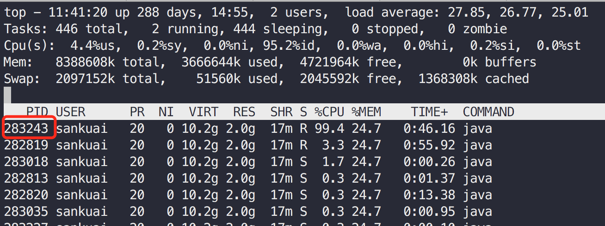
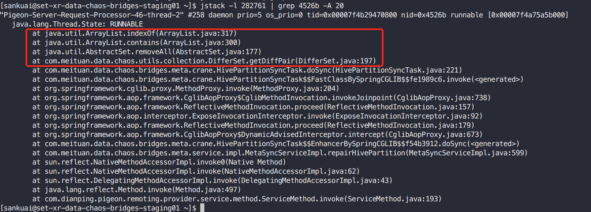

# 背景
先来看一段代码：
```$java
    /**
     * 严格比较A, B两个集合，返回差集对((A - B), (B - A))
     * 以hashCode来比较
     *
     * @param left
     * @param right
     * @param <E>
     * @return
     */
    public static <E> Pair<Set<E>, Set<E>> getDiffPair(final Collection<E> left, final Collection<E> right) {
        Set<E> leftSet = new HashSet<>(left);
        Set<E> rightSet = new HashSet<>(right);

        leftSet.removeAll(right);
        rightSet.removeAll(left);

        return Pair.of(leftSet, rightSet);
    }
```
这是我们项目中的一段祖传代码，封装在我们的工具类中。作用很简单输入两个Collection, 求这两个Collection的**互为差集对**，并组装成一个`Pair`对象。 <br>
`Pair`就是一个简单的用于组装二元组的类：
```$java
public class Pair<A, B> {

    @Nullable
    private final A first;
    @Nullable
    private final B second;

    /**
     * Creates a new pair.
     *
     * @param first  The first value.
     * @param second The second value.
     */
    public Pair(@Nullable A first, @Nullable B second) {
        this.first = first;
        this.second = second;
    }
}
```

这个工具方法在我们的项目中被广泛得使用，一直没出过问题，直到今天（2020-08-20），让我差点掉进坑里。<br>
在开发好一个优化feature后，我将代码部署到预发环境进行验证。在启动验证job后，job一直没有跑完（理论上预期为几分钟），怀疑流程卡在某处，于是开始进行排查。

# 排查过程
## 打log确定问题操作
整个流程是：
1. 查库
2. 内存操作（主要是做diff判断，利用上文中的工具方法）
3. 写库

于是很快想到是可能是卡在1，3这两个读写库的操作上。于是在代码中添加了一些测试log重新上线验证，结果发现：
`查库完成`的log很快被输出，而`开始写库`的log迟迟没有输出。那么排除一切不可能，剩下的就是真相: 流程卡在第二步内存操作处，<br>
第二步的内存操作主要就是利用上文中的工具方法计算diff，因为这个diff方法我们代码中经常使用，并没出过问题，所以确实很诡异。
## jstack验证
既然是卡在内存操作，那么CPU肯定是能吃到100%的，我们可以利用`jstack`来定位程序卡在何处。

1. **jps确定进程pid**
```$shell
[sankuai@**-**-chaos-bridges-staging01 ~]$ jps
282761 chaos-meta-offline-bridge-0.0.1-SNAPSHOT.jar
284370 Jps
```
2. **top查看JVM进程中的线程CPU消耗**
执行 `top -Hp 282761`

可以看到`283243`这个线程的CPU消耗接近100%，大概率这就是我们的问题程序执行线程。

3. **线程id转为16进制**
```$shell
[sankuai@**-**-chaos-bridges-staging01 ~]$ printf "%x\n" 283243
4526b
```
`283243`转为16进制是`4526b`
4. **利用jstack 定位问题代码**
执行 `jstack -l 282761 | grep 4526b -A 20`

通过执行多次上述jstack命令，发现线程一直卡在此处，证明这是我们的热点代码。

> 也可通过JProfiler、Arthas等诊断工具定位。

# 问题分析
既然定位到了问题代码，就出在上述的工具方法中。且能看出来是在执行`ArrayList.contains`方法。
我们都知道，对于`List`的`contains`方法，那可是`O(N)`的啊。为什么会出现这个操作呢，我们需要来重新审视下这个工具方法。
```$java
public static <E> Pair<Set<E>, Set<E>> getDiffPair(final Collection<E> left, final Collection<E> right) {
    Set<E> leftSet = new HashSet<>(left);
    Set<E> rightSet = new HashSet<>(right);

    leftSet.removeAll(right);
    rightSet.removeAll(left);

    return Pair.of(leftSet, rightSet);
}
```

在我们的case中，我们的入参是两个`ArrayList`，目的是求出这两个`ArrayList`的差集对。整个过程为：
1: 将这两个`ArrayList`的内容复制到两个`HashSet`中。
2: 从复制后的两个`HashSet` 利用`removeAll`方法移除`ArrayList`中的元素。<br>
从`HashSet`中`removeAll`一个`ArrayList`会发生什么，我们来看下JDK源码：

```$java
public boolean removeAll(Collection<?> c) {
    // 校验入参不能为空
    Objects.requireNonNull(c);
    // 代表有没有发生了元素移除操作
    boolean modified = false;
    
    // 这是一个优化项，判断本Set和入参集合c的大小，利用小集合驱动大集合
    if (size() > c.size()) {
        for (Iterator<?> i = c.iterator(); i.hasNext(); )
            modified |= remove(i.next());
    } else {
        // 如果入参集合c大，则遍历本Set, 判断入参集合c包不包含元素
        for (Iterator<?> i = iterator(); i.hasNext(); ) {
            if (c.contains(i.next())) {
                i.remove();
                modified = true;
            }
        }
    }
    return modified;
}
```
坑就坑在JDK的这个优化，假设从一个Set中移除List, JDK会首先判断哪个集合更小。然后遍历小集合，判断小集合中的元素在大集合中存不存在。
那在我们的case中，List要比Set大，那么会遍历Set中的元素，**判断该元素在List中存不存在(`ArrayList.contains`)**，若存在，则进行删除。
而`ArrayList.contains`是个`O(N)`操作，因此整个`removeAll`变成了`O(N^2)`.
> 有点类似SQL的join优化，用小表驱动大表。

而我们的case中，做diff的两个List大小为100多万。可想而知，这个`O(N^2)`操作会多慢。

# 总结
1. 在封装工具方法时需要格外谨慎，因为工具方法一般都是对一些常用操作的封装，使用频繁，一定要保证健壮性。虽然这个方法使用了很久都没出过问题，但根据墨菲定律，只要有潜在bug，那么该bug一定会发生。
2. 我们可以使用Guava等优秀工具包中的方法来替换自己封装的方法，毕竟这些包都是经过大规模生产验证的。
3. JDK的这个优化看起来值得商榷，本意是为了加速，但在我们的这个case中反而弄巧成拙，个人觉得JDK可以加入一个判断，当元素数量较多时，要规避这种优化，甚至可以用空间换时间，将非Set集合转为Set，再进行移除操作。
4. 对List求差集，看来不是一个好的主意。


