# 背景
最近新上线了一个服务，业务方反映服务的某个接口会随机的变慢，大约耗时5s左右。因为出现问题的接口业务逻辑非常简单，只有几次简单的查库操作，且服务刚上线，流量很低，肯定不是并发过高导致，所以5s这个耗时显然十分诡异。从下图的服务监控可以看到，该接口的平均耗时3.8775s，且该接口一个小时内只有4次调用。
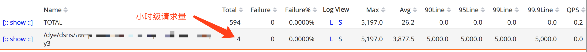 

经过一番测试排查，发现该问题的几个重要特征：
1. **变慢的case有一个非常重要的共性：服务内部抛了我们自定义的异常`ServiceException`（这个异常可以简单认为是调用方传来了不符合预期的请求参数，属于正常情况）。**
2. **这个变慢是随机的，另外当服务刚启动的一段时间内接口是正常的(正常情况下的响应时间是20ms左右)。**
3. **从线上环境以及我们的预发环境该问题都可以得到稳定复现，只有在本地复现不了。**

看起来这确实是一个令人头疼的问题。

# 排查过程
## 代码分析
该接口的业务逻辑非常简单，只有几次简单的查库操作，另外当正常请求（调用方传参正确，不抛`ServiceException`）时平均耗时只有20ms，这说明问题肯定不是发生在业务逻辑中。

那么当抛`ServiceException`时我们的服务做了哪些操作呢？
我们通过继承Spring的`ResponseEntityExceptionHandler`对`ServiceException`做了统一处理。处理逻辑很简单，由于你懂得原因，此处不贴具体代码。该处理逻辑主要干了两件事：
1. 通过log.error的方式记录下该异常。
```java
log.error("happened service exception!", ex);
```
2. 将`ServiceException`包装成我们统一的输出格式返回。

问题肯定出在这两个环节。

## 远程调试
由于本地复现不了这个问题（在本地测试时接口响应耗时普遍在50ms），所以想到用远程调试的方式去我们的预发环境debug看看，看下问题出在哪一步。


在服务启动脚本中加入以下命令便可在本地IDEA中进行远程调试。服务启动后将会暴露出5005端口，我们可在本地通过该端口连接远程服务，进行远程调试。具体可参考：[IDEA 远程调试](https://www.cnblogs.com/victorbu/p/10904732.html "IDEA 远程调试")
```shell
-agentlib:jdwp=transport=dt_socket,server=y,suspend=n,address=5005
```
> 当然一般公司内线下环境跟线上环境会有网络隔离，所有你需要一个特殊的姿势来从线下访问线上环境。

成功启动远程调试后，打好断点，在本地发出测试请求，很容易定位到卡在了打印日志的那一行。
继续追到`log.error`内部打断点，但由于线上业务一直有其他线程在打日志，而任何线程都会被我们断点拦截（可以认为是流量干扰），所以没法再继续深入debug.   
但我们已经成功地缩小了排查范围：**问题出在打印错误日志的那一行**
```java
log.error("happened service exception!", ex);
```
并既有可能是打印错误堆栈造成的。
定位到此之后，为了不继续影响线上业务，将该语句改成只log一下`ServiceException`的message(即不打印异常堆栈)
```java
log.error("happened service exception! message:{}", ex.getMessage());
```
并紧急上线，上线后业务反应接口正常了。

接口慢的问题是解了，但这个解法过于粗暴，关闭异常堆栈打印的做法，显示不利于线上问题的排查。
因此还需要继续往下追。

## 灵机一动
现在远程调试由于流量干扰走不通了，而本地又一直无法复现该问题，所以排查陷入了一个死胡同中。但有时就是山重水复疑无路，柳岸花名又一村。突然想到我们线上部署时是将服务打成war包（服务是SpringBoot应用，为什么使用war包部署，属于历史遗留问题），然后再利用`java -jar xx.war`来执行这个war包。  

而本地调试时，在IDEA内部直接启动SpringBoot的入口函数，是将项目代码编译成class文件放置到`target`目录中，并将`target`目录加入`classpath`，并将所有依赖的jar包也加入`classpath`（关于IDEA启动SpringBoot的过程是笔者的猜测，因未在`target`中找到可执行的jar包或者war包）。
> 注：本地启动时未使用maven来启动SpringBoot项目，而是执行在IDEA中运行入口函数


*那会不会是部署方式引起的呢？因为代码是一致的。*

将线上部署脚本在本地执行一遍，以启动线上服务的方式来启动本地服务。（本质就是利用maven将服务先打成war包，然后再使用`java -jar xx.war`来启动这个war包）

谢天谢地，本地也能复现这个问题了。

更进一步，我很好奇如果将服务打成jar包执行呢？实验显示，**通过jar包启动服务的话，接口响应正常，无法复现该问题。**

那么该问题又多了一条重要的性质： 

4. **只在使用war包部署后出现，直接启动或者使用jar包部署后服务正常。**

## JProfiler诊断
既然本地能够复现，那么问题就好办了。我们现在需要知道的是`log.error`里面究竟发生了什么。本来想通过远程调试本地war包进程的方式来追踪卡在哪儿，但不幸的是，由于我们服务引用了很多中间件，即使没有业务流量，这些中间件也在疯狂抛日志，都会执行log4j2的实现代码，不方便使用断点来进行调试。  

因为我们的问题是一个接口执行流程慢，因此最重要的是定位出慢在了哪个步骤，具体点：就是线程阻塞在或者长时间运行在哪个函数中。java生态有很多这种性能诊断工具，比如[JProfiler](https://www.ej-technologies.com/download/jprofiler/files "JProfiler")或者阿里的[Arthas](https://github.com/alibaba/arthas "Arthas").这里笔者使用JProfiler来进行分析。

将服务在本地使用war包方式启动后，通过JProfiler attach上我们的java进程。
我们在连接前先定义下过滤规则（就是告诉JProfiler监控哪些包下的类或者哪些类）。
笔试增加了三条包规则：`com.sankuai`,`com.meituan`(我们的业务逻辑都在这两个包下)
以及`org`因为关键分析内容log4j2、以及日志门面slf4j都是以org开头的包。如下图所示：
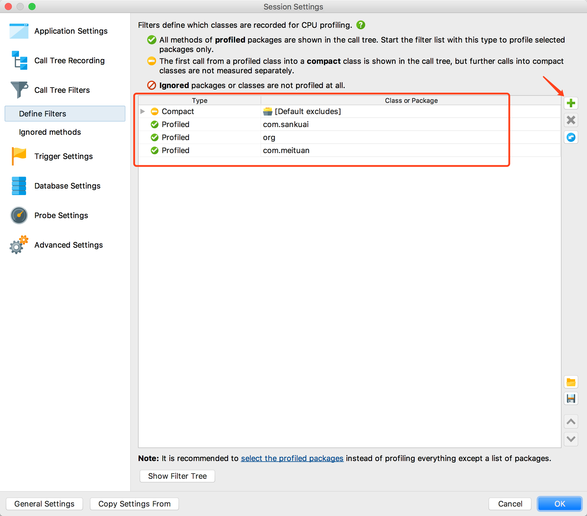 

连接好之后，我们主要关心调用栈中哪一步耗时最长，我们点击左侧面板的`CPU views`, 然后点击左上角的按钮来开启监控。如下图所示：


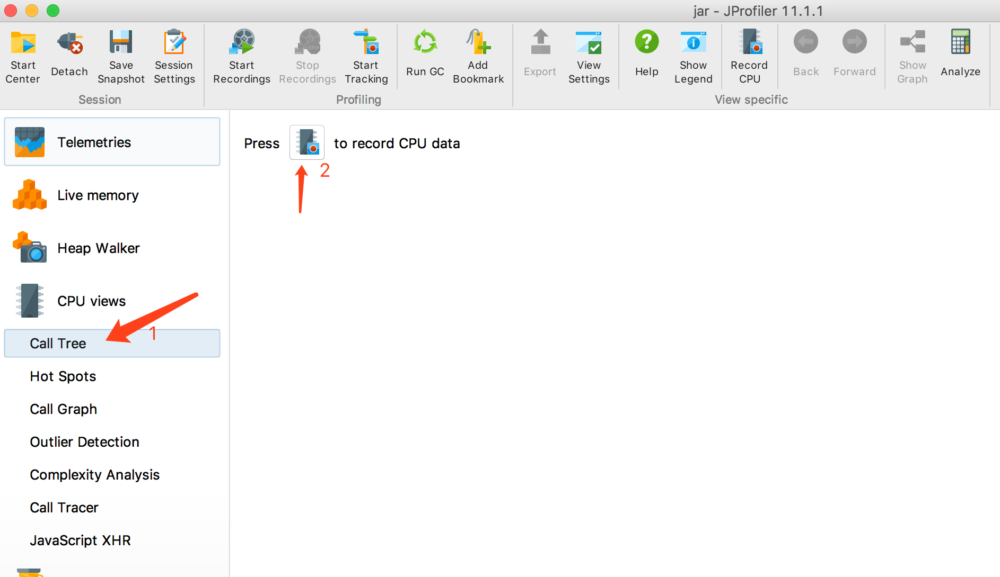 

开启监控后，我们立马通过postman发起一次请求调用，调用完成后，立即点击上方的`Stop Recordings`来停止监控。

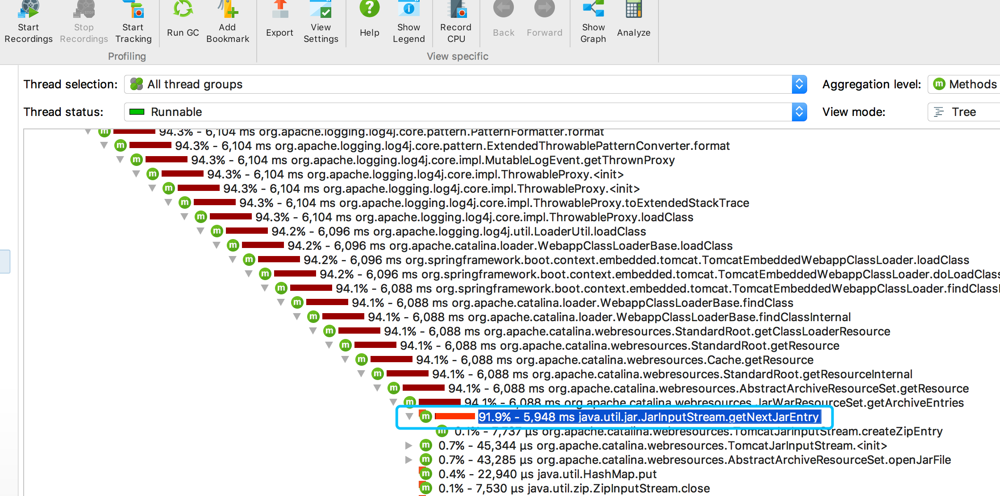

由于线程堆栈很长，因此直截取了最后的部分。可以看出我们的统计时间段内，91.9%(接近6s)的CPU时间都被`java.util.jar.JarInputStream.getNextJarEntry`这个方法所占用，从方法签名可以看出来这是JDK自带的一个方法，用来获取下一个jar包的某些信息。

另外也可以从线程快照中看出来。点击左侧面板中的`Threads`，发起请求调用后，可在请求完成前(我们的case中该请求有5s多的耗时，足以从postman切过来)点击左上方按钮，dump下当前线程快照，每点击一次，就会生成一份快照。

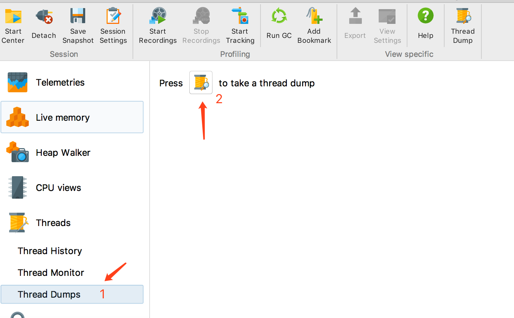

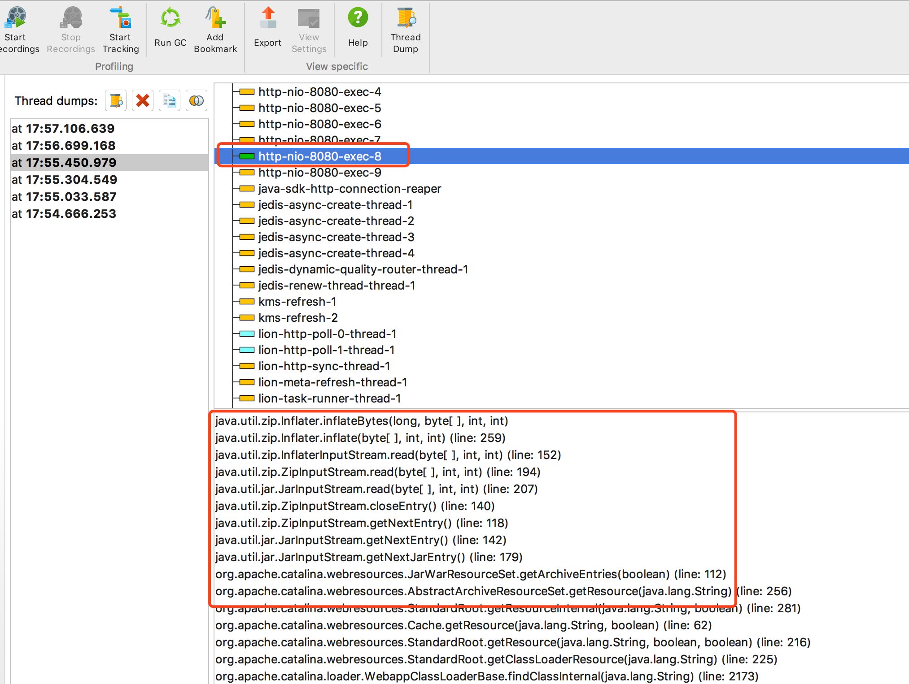

可以看出我拍了6份快照，我们随便点开一份快照，找到<font color=#00ff00>绿色</font>线程（<font color=#00ff00>绿色</font>代表RUNNING)是`http-nio-8080-exec-8`。这其实是tomcat的连接处理线程。我们从线程堆栈中也能看出线程在执行`java.util.jar.JarInputStream.getNextJarEntry`附近的代码。

那问题代码块就定位清楚，就出在这行代码附近。

## 简化复现环境
定位清楚了问题代码，就需要我们能一步步调试进去，明白整个处理流程。但由于之前说的，即使在线下，由于服务引入的大量中间件也在时刻打着日志，严重影响我们的调试。因此只能提取出一个干净的问题复现环境。

### 环境准备
* SpringBoot:   1.5.9.RELEASE
* slf4j: 1.7.22
* log4j: 2.7
* jdk: 1.8
* System: *nix

项目代码地址：https://github.com/ayonel/slf4j2-slow

项目功能非常简单，只有一个接口，当该接口抛自定义异常`ServiceException`时会走到统一处理逻辑`WebExceptionHandler.handleServiceException`。该函数只做2件事，打印错误日志，包装错误信息成统一的响应格式，并返回。
```java
    /**
     * handle ServiceException
     *
     * @param ex            the exception
     * @param webRequest    the current request
     */
    @ExceptionHandler(value = {ServiceException.class})
    public final ResponseEntity<WebRestResult> handleServiceException(ServiceException ex, WebRequest webRequest) {
        // STEP1: 打印错误日志
        log.error("happened service exception!", ex);
        // STEP2: 包装错误信息，并返回
        HttpHeaders headers = new HttpHeaders();
        headers.setContentType(MediaType.parseMediaType(MediaType.APPLICATION_JSON_UTF8_VALUE));
        WebRestResult restResult = new WebRestResult(-1, ex.getMessage(), null);
        return new ResponseEntity<>(restResult, headers, HttpStatus.OK);
    }
```
该程序支持两种部署方式，jar 以及 war。

部署方式 | 服务端口 | 远程调试端口 | 测试URL |  响应时间
:-: | :-: | :-: | :-: | :-:
war | 8080 | 5005 | localhost:8081/hello/war | <font color='red'>~400ms</font>
jar | 8081| 5006 | localhost:8080/hello/jar | <font color='green'>~30ms</font>
执行根目录下的`bootstrap-jar.sh`或者`bootstrap-war.sh`会分别以jar或者war的方式部署。启动程序后，多进行测试调用（可以使用ab命令），便可复现问题。
> 注意！！！部署前，一定保证pom.xml中的<package>标签中的内容跟你要执行的模式保持一致。也就意味着，需要先修改pom.xml中的<package>，再执行部署脚本。

当调用测试URL后，预期会返回：
```json
{
    "code": -1,
    "message": "do not call me jar, error occurred!!!",
    "data": null
}
````
代表服务发生业务异常，向前端传回了异常信息。

该服务启动后，除非调用测试URL才会打印一条错误日志，除此之外，再无其他线程打印日志，因此可以排除其他线程的干扰，放心调试。

日志文件在`target`文件夹下，以jar包启动的会写入jar开头的文件中；以war包启动的会写入war开头的文件中。

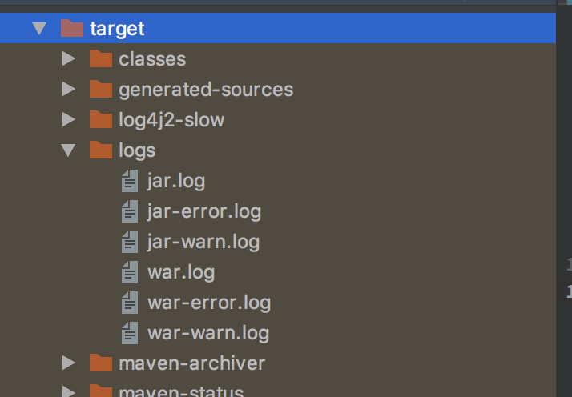

## 源码调试
### 问题代码定位
我们先来调试war包模式的代码。我们在`java.util.jar.JarInputStream.getNextJarEntry`附近打上断点，开始进行调试。
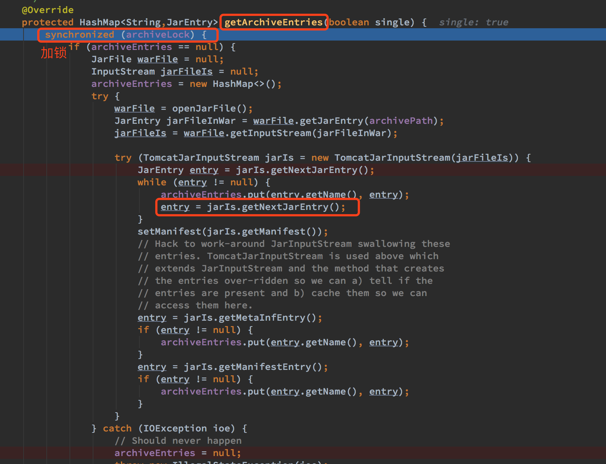
可以看到是`org.apache.catalina.webresources.JarWarResourceSet#getArchiveEntries`这个方法（记住这个方法，下文还会讲到）中在循环调用`getNextJarEntry`方法。并且这个方法其实是个同步代码块，加上了锁。（当然在我们的测试中，由于只有一个线程在执行这个方法，所以并不存在锁竞争问题，但这个锁对向上服务肯定有着影响，这其实也是线上接口5s多的原因之一）。
那么`org.apache.catalina.webresources.JarWarResourceSet.JarWarResourceSet#getArchiveEntries`这个方法是做什么用的呢？

在解释这个问题前，我们先不着急，因为这只是调用栈的最深入，为了看清问题的全貌我们需要往前看，这个调用是在哪儿触发的。通过查看源码调试及查阅网上资料，最终将目光投向了`org.apache.logging.log4j.core.impl.ThrowableProxy.toExtendedStackTrace`这个函数.

### ThrowableProxy
先解释下`ThrowableProxy`这个类是什么，从名字上看这个一个对异常的代理包装。在我们的case中就是对`ServiceException`的包装，那为什么需要这个类呢？先看下该类的注释：
> A proxy is used to represent a throwable that may not exist in a different class loader or JVM. When an application deserializes a ThrowableProxy, the throwable may not be set, but the throwable's information is preserved in other
 fields of the proxy like the message and stack trace.

大意就是为异常添加一些扩展信息，用于从不同的JVM或者类加载器标识这个异常。

LogEvent（log4j2对日志事件的封装）可能存在跨网络传输的情况，而本地的LogEvent中的异常栈可能传给另一个JVM，此时该异常栈可能不会被识别，因此需要对异常进行扩展，添加扩展信息，比如异常栈中方法所属的jar包，以及版本。

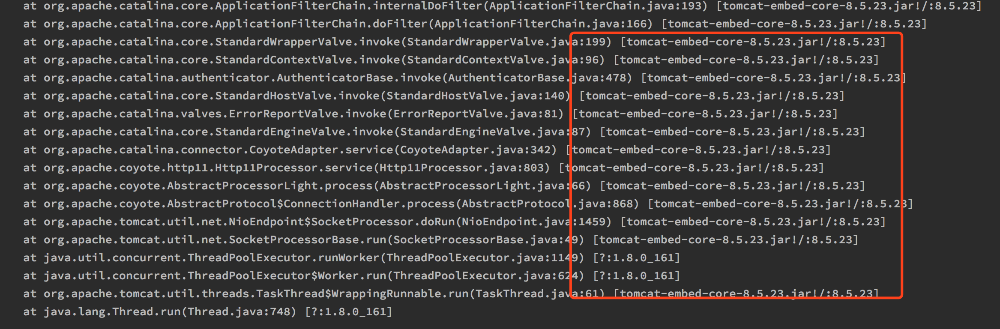
如上图的所以，这些扩展信息就是异常栈中每个方法所属的jar包及版本。（万恶的根源）

`org.apache.logging.log4j.core.impl.ThrowableProxy#toExtendedStackTrace`这个方法做的事就是将异常栈的每个方法，添上这些扩展信息。

由于这个方法比较复杂，我就不贴代码了，感兴趣的同学可以自己研究下。我总结下这个方法大致做了什么：
1. 为了得到方法的扩展信息，需要拿到方法所属的类，从类中拿到所属jar包(location)以及版本（version）。
> 扩展信息当然不是直接从Class对象中得到，可以具体看`ThrowableProxy.toCacheEntry`方法
2. 因为异常栈中并没有保存Class对象，只有所属类名，因此需要做类加载。log4j2做了一个优化，将当前线程栈跟异常堆栈做一个对比，大部分情况他们都是有同样的根节点，如果线程栈中的类跟异常堆栈中的类名相等，那么就不需要做类加载了，直接拿线程栈中的类对象即可。否则，需要做类加载。
>通过`final Stack<Class<?>> stack = ReflectionUtil.getCurrentStackTrace()`获得线程栈，栈中的元素就是Class对象）

<font color='red'>**问题就出在类加载这里..**.</font>
### tomcat类加载机制
在这里我们先来了解下类加载的相关知识，更具体的，是要明白tomcat的类加载原理，感兴趣的可以看下这篇官方文档：[Class Loader How-To](https://tomcat.apache.org/tomcat-8.5-doc/class-loader-howto.html)

tomcat环境下的类加载器的父子关系为：
```shell
      Bootstrap
          |
       System
          |
       Common
       /     \
  Webapp1   Webapp2 ...
```


这里我总结下tomcat环境默认加载一个类的顺序：
1. 从JVM的Bootstrap类加载器(加载rt.jar、resources.jar、charsets.jar等)中尝试加载
2. 从Webapp类加载器中加载,将按照顺序从：
    1. 从Web应用的/WEB-INF/classes中尝试寻找加载
    2. 从Web应用的/WEB-INF/lib\/\*.jar中尝试寻找并加载
4. 从System类加载器（又称应用类加载器,默认加载CLASSPATH中的类）中尝试加载
5. 从Common类加载器（加载tomcat的一些公共类）中尝试加载

我们可以看出这个默认加载顺序，实际上背离了`双亲委派`原则。为什么这么做，[Class Loader How-To](https://tomcat.apache.org/tomcat-8.5-doc/class-loader-howto.html)
中其实已经解释了。这个优化可以通过配置`<Loader delegate="true"/>`来关闭。
>As mentioned above, the web application class loader diverges from the default Java delegation model (in accordance with the recommendations in the Servlet Specification, version 2.4, section 9.7.2 Web Application Classloader). **<font color='red'> When a request to load a class from the web application's WebappX class loader is processed, this class loader will look in the local repositories first, instead of delegating before looking. </font>**

### log4j2是如何加载类的
那我们再结合源码来看下,当log4j2真正需要加载类时是怎么做的？

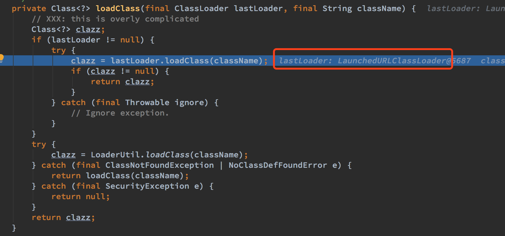
1. 先尝试用`lastLoader`来加载，这个`lastLoader`是指在处理异常堆栈的过程中，上一次加载类的加载器或者上一个线程堆栈中类对象的加载器。
> 可以看到当前的`lastLoader`是`LauncherURLClassLoader`,这是SpringBoot实现的一个自定义加载器，用来实现jar in jar中class文件的加载。详见：
[springboot应用启动原理(二) 扩展URLClassLoader实现嵌套jar加载](https://segmentfault.com/a/1190000013532009)
2. 如果没加载到，尝试用`LoaderUtil.loadClass`来加载
3. 如果还没加载到，则调用ThrowableProxy这个类自身的加载器来加载。


那么`LoaderUtil.loadClass`中做了什么呢？
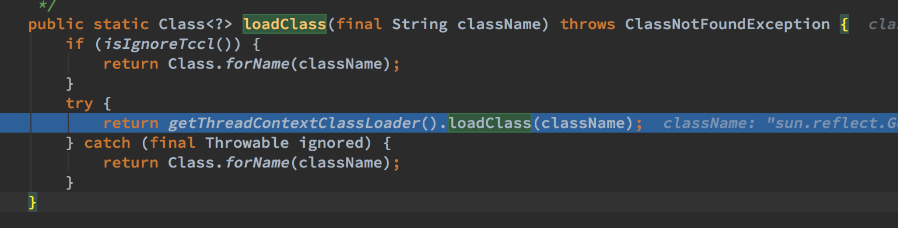
1. 如果配置了要忽略线程上线文加载器(TCCL),则直接进行`Class.forName`加载
2. 否则先尝试用TCCL加载
3. 用TCCL加载发生异常时，再用`Class.forName`兜底
>线程上下文类加载器是从 JDK 1.2 开始引入的。Java.lang.Thread中的方法 getContextClassLoader()和 setContextClassLoader(ClassLoader cl)用来获取和设置线程的上下文类加载器。如果没有通过 setContextClassLoader(ClassLoader cl)方法进行设置的话，线程将继承其父线程的上下文类加载器。Java 应用运行的初始线程的上下文类加载器是系统类加载器，在线程中运行的代码可以通过此类加载器来加载类和资源。[出处链接](https://blog.csdn.net/justloveyou_/article/details/72231425)


TCCL是通过`Thread.currentThread().getContextClassLoader();`获得的，而当前线程是`http-nio-8080-exec-7`,这个线程是tomcat用来处理链接的线程，TCCL为：`TomcatEmbeddedWebappClassLoader`
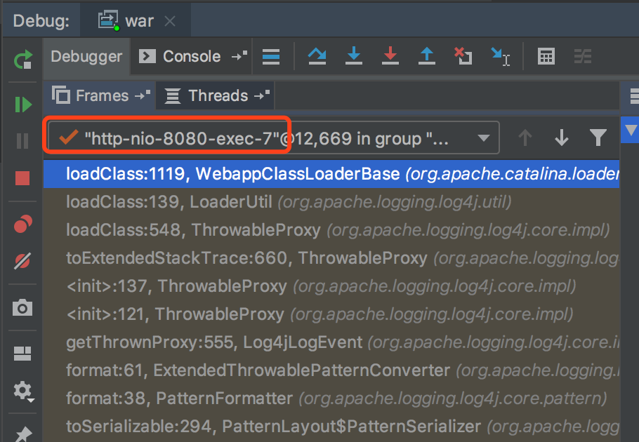

这个`TomcatEmbeddedWebappClassLoader`正是Webapp类加载器，我们分析下它加载类的过程。
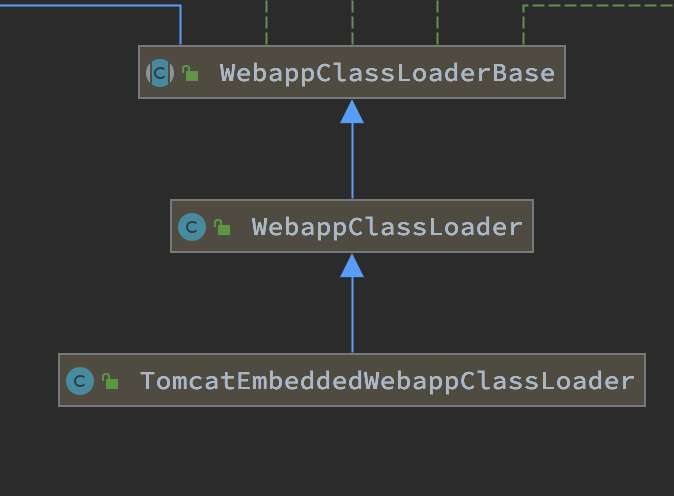

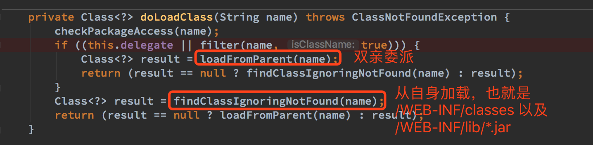

**可以看出跟tomcat官方文档描述的一致**，默认从自身进行加载，只有当配置了`delegate=true`之后才先尝试利用父加载器加载，当从父加载器中未找到时，才从自身加载。由于我们并没有配置`delegate`参数，所以会优先从`/WEB-INF/classes`以及`/WEB-INF/lib\/\*.jar`中加载。

### 罪魁祸首
现在我们来思考一个问题：
异常堆栈中的函数要么是业务代码，要么是log4j2中的方法，这些类应该被SystemClassloader(又称应用类加载器)加载过了，这些类对象应该已经存放在方法区中，`Class.forName`实际就是查询下元空间（堆外内存，使用DirectByteBuffer操作，要比堆内内存还快）。我们异常堆栈中就几十个类，真正需要加载的（大部分类在线程堆栈中已经拿到）也就几个，根本不可能耗时400ms,线上更是恐怖的5s.
>Class.forName会调用native的JVM实现，调用前该方法会确定准备好需要加载的类名以及ClassLoader，将其传递给native方法，进入到JVM实现后，首先会在SystemDictionary中根据类名和ClassLoader组成hash，进行查询，如果能够命中，则返回。出处：[Class.forName和ClassLoader.loadClass](https://www.jianshu.com/p/aedee0e14319])

通过逐步调试，验证了异常栈中每个类的加载都非常快，除了它：`sun.reflect.GeneratedMethodAccessor<N>`, N是数字。
一旦需要加载这个类，则会变得很慢。

那这个类是做什么用的，为什么会出现在我们的异常栈中呢？

经过相关google，该类实际上是JVM对反射调用的优化。


jvm对待反射有两种方式：

> 1. 使用native方法进行反射操作，这种方式每次执行的速度差不多
> 2. 生成bytecode进行反射操作，即生成类sun.reflect.GeneratedMethodAccessor<N>，它是一个被反射调用方法的包装类，代理不同的方法，类后缀序号会递增。这种方式第一次调用速度较慢，较之第一种会慢3-4倍，但是多次调用后速度会提升20倍。

> 出处：[一个关于log4j2的高并发问题](https://juejin.im/post/5b7d5b34518825430810be8e)（**特别鸣谢该篇文章，在定位到GeneratedMethodAccessor的问题后，查到了这篇文章，文中的case跟本case有部分相通的地方**）

JVM默认当一个反射方法被调用超过一个阈值（inflationThreshold，默认15）时会使用第二种方式来做优化,也即生成`GeneratedMethodAccessor\<N>`。
>该阈值可以通过jvm参数-Dsun.reflect.inflationThreshold进行配置。

**到了最关键的一步，为何加载`GeneratedMethodAccessor<N>`会这么慢？**
### GeneratedMethodAccessor<N>加载为何如此慢？
`GeneratedMethodAccessor<N>`在JVM中是一个比较特殊的类，该类只能通过一个特定的类加载器`DelegatingClassLoader`来加载，也就是说WebApp类加载器以及其他类加载器都加载不到这个类，抛出`ClassNotFoundException`.

我们来看看`TomcatEmbeddedWebappClassLoader`为何对这个特殊类的加载会如此慢？

在`TomcatEmbeddedWebappClassLoader.findClassInternal`中会将该类名当做一个资源在war包中寻找。具体做法是将"/WEB-INF/classes" + className 作为路径在**war包中的每个jar包中搜索。**

来看看具体的搜索过程`org.apache.catalina.webresources.StandardRoot.getResourceInternal`方法，如下图所示：
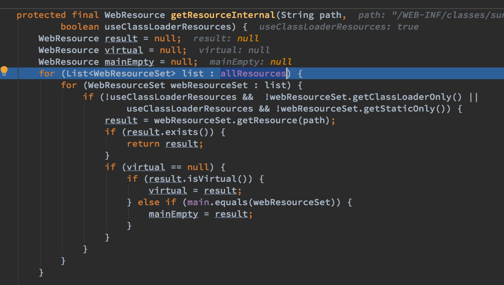

可以看出是从`allResources`中进行进行遍历搜索，`allResources`是一个二维List, 其中有5类资源集合。

```java
 private final List<List<WebResourceSet>> allResources =
            new ArrayList<>();
    {
        allResources.add(preResources);
        allResources.add(mainResources);
        allResources.add(classResources);
        allResources.add(jarResources);
        allResources.add(postResources);
    }
```
其中的元素`WebResourceSet`代表一种资源，比如一个目录、一个jar包或者一个war包。
>Represents a set of resources that are part of a web application. Examples include a directory structure, a resources JAR and a WAR file.

下图是`allResources`的具体情况
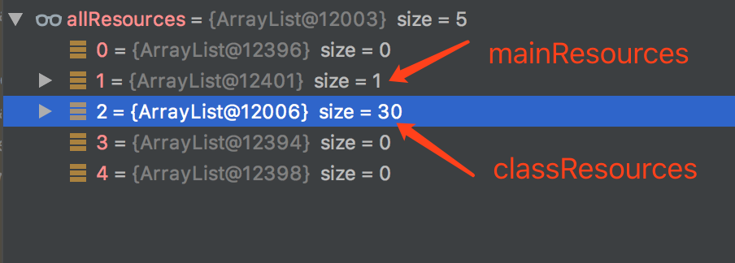
其中`mainResources`中只有一种资源，其实就是我们服务打成的war包，`/{path}/log4j2slow/target/log4j2-slow.war`

而`classResources`居然有30个元素，里面是什么呢？其实就是我们服务依赖的所有jar包。

加载`GeneratedMethodAccessor`类的过程中，居然要扫描31个资源。来看看每次扫描中做了什么，具体实现是`org.apache.catalina.webresources.AbstractArchiveResourceSet.getResource`方法，我截取出关键代码片段如下：
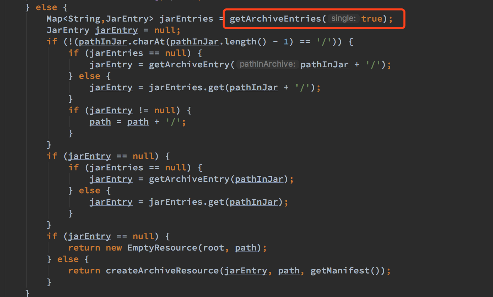
图中红框圈出的方法在之前就已经介绍到了。该方法的作用是解析该jar包，拿到一个缓存，`HashMap<String,JarEntry>`, 我们暂且称之为**jar包文件缓存**， key为jar包中目录或者class文件的路径，value为`JarEntry`，代表jar包中的一个文件（目录也算一个文件）。
有了这个缓存，再需要从这个jar中提取某个类，只需要从这个缓存中提取就可以了。


从JProfiler的分析结果可以看出，链路的症结就在构建该缓存的逻辑`getArchiveEntries`中，其内部循环调用`TomcatJarInputStream.getNextJarEntry`来拿到该jar包中的文件，并且该过程是加锁的（之前已经分析过）。
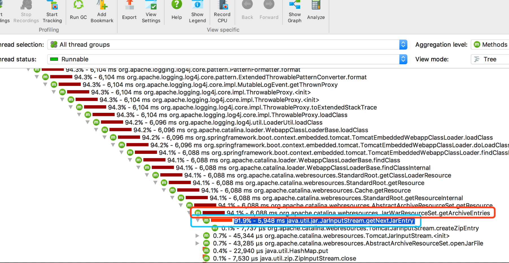

总结下：`TomcatEmbeddedWebappClassLoader`加载`GeneratedMethodAccessor`时，如果从每个jar包中提取该类的class文件，如果存在**jar包文件缓存**，则直接从缓存取，不存在的话，需要构造一遍**jar包文件缓存**（耗时就耗在这个jar包缓存构建上）

### jar包文件缓存失效
按道理说，如果构建了**jar包文件缓存**，之后判断jar中是否包含某个文件，应该是非常快速的事，但为什么之后的请求还是会出现变慢的情况呢？难道这个**jar包文件缓存**会失效？

**是的，它的确会失效**
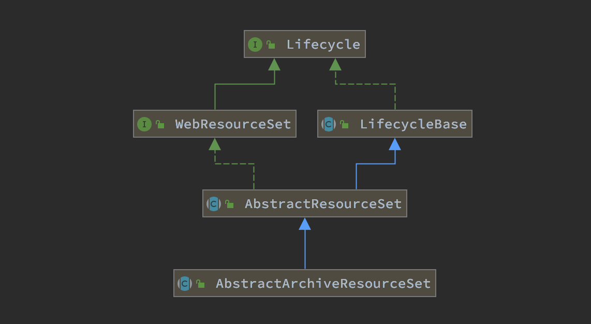
我们可以看到jar包文件缓存所在类，实现了`WebResourceSet`接口，该接口中有一个方法叫做`gc`，
```java
 /**
     * Implementations may cache some information to improve performance. This
     * method triggers the clean-up of those resources.
     */
    void gc();
```
从注释上我们能看出来，这个方法用来清理一些用于加速的缓存。来看看具体实现。
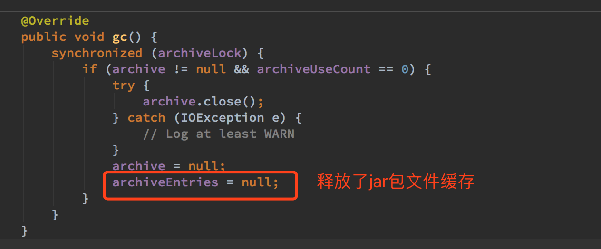

那这个方法的触发时机呢？

Tomcat有个后台线程每隔固定时间来触发这个方法，我们的case中是30s就来清理一遍缓存。

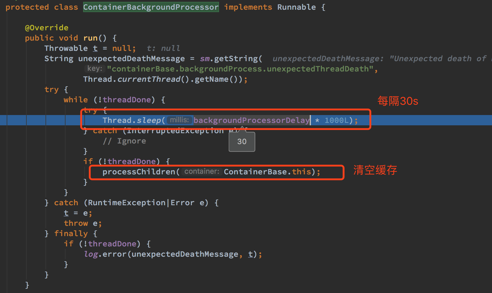

至此，我们弄清楚了war包部署下为何慢的问题。

### jar包部署模式为何不慢？
我们将示例项目中的`pom.xml`改成jar包模式，然后运行`./bootstrap-jar.sh`
并通过5006端口进行调试（服务启动后至少调用15次测试接口），很容易就发现了问题所在。

这是jar包部署下，加载`GeneratedMethodAccessor<N>`时的`allResources`, 可以看出其中只有一个`mainResources`终有一个元素，并且是个`DirResourceSet`，其内部加载一个路径时，只需要以读文件的方式去获取就可以了，可以理解为只有一次简单的IO，不会逐个扫描每个jar包。
>本case中路径为/{path}/log4j2slow/src/main/webapp/WEB-INF/classes/sun/reflect/GeneratedMethodAccessor27.class

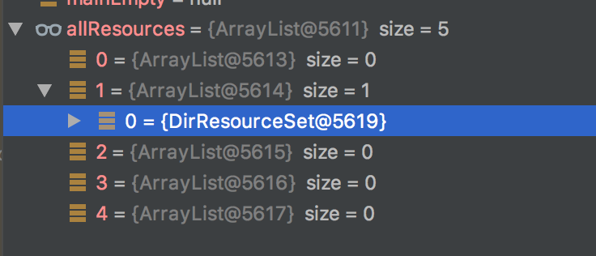


至此，整个问题现在算比较清晰了！

# 总结
我们来总结下原因，原因是多方面的：
1. JVM对反射的优化，导致该接口调用超过15次之后，异常栈中会有`GeneratedMethodAccessor<N>`类。
2. log4j2打印异常栈时，需要额外获取类的所属jar息，版本等额外信息，需要进行类加载。
3. 在war包模式部署下，加载`GeneratedMethodAccessor<N>`类时，会同步线性扫描所有jar包，在此过程中会将该jar包中的所有文件构建成一个缓存（最耗时的部分），而jar包模式部署下则只需要一次文件读取，无此问题！
4. 该缓存构建好之后，默认30s后就会被清理，导致之后的异常请求需要重新构建缓存，继续变慢。

我们清晰了问题发生的整个过程，其他现象也能解释通了。

1. Q:为很么当服务刚启动的一段时间内正常，之后才爆出来？
> A：准确地讲，应该是服务刚启动的前15次调用正常，之后才会出现该问题。

2. Q: 为什么示例项目慢接口为400ms左右，而线上项目长达5s?
> A: 示例项目时个精简版项目，只有最基础的spring、log相关的依赖（30）个jar包，而我们线上服务有多达280个依赖，因此耗时更长。

3. A：为什么变慢是随机的？
> 准确地讲，当jar包文件缓存还未被清理前，这时候的请求不会涉及到IO操作（读jar包中的资源），仅仅是从内存操作，因此处理很快。但是当缓存被后台线程清理后，之后的第一个请求又需要重建缓存，开始变慢，并且由于构建缓存时是同步代码，还会影响其他请求。


## 问题解法
既然问题定位清楚了，那么如何解决呢？（其实按道理将，这应该算log4j2本身的一个bug，它未考虑到`GeneratedMethodAccessor<N>`这种特殊类）

1. log4j2可以修复这个bug。
 > 短时间内不现实

2. 使用jar包部署服务。
> SpringBoot应用其实更推荐使用jar包部署。使用jar包部署可以规避大部分问题，但是当异常请求量很高时，由于加载`GeneratedMethodAccessor<N>`时的同步操作，仍然有可能将log4j2中的RingBuffer打满，导致线程block

3. 对于能明确原因的异常，不用打印异常堆栈，或者精简异常堆栈（比如只打印1层）
> 比如我们的`ServiceException`是我们自定义的业务异常，异常原因一般都会放在message中，通过该message能很快定位到问题代码，不需要详细异常堆栈也能排查。


## 番外
`log4j2.error(message, throwable)`这个方法本身就比较慢。在log4j2的tracking list中已经有人提出了这一点，但目前官方还未merge。
[LOG4J2-2391](https://issues.apache.org/jira/browse/LOG4J2-2391?jql=project%20%3D%20LOG4J2%20AND%20resolution%20%3D%20Unresolved%20AND%20text%20~%20%22toExtendedStackTrace%22%20ORDER%20BY%20priority%20DESC%2C%20updated%20DESC)

# 参考文献
http://javaquan.com/post/16963_1_1.html
https://juejin.im/post/5b7d5b34518825430810be8e
https://www.jianshu.com/p/aedee0e14319
https://tomcat.apache.org/tomcat-8.5-doc/class-loader-howto.html
https://blog.csdn.net/bigtree_3721/article/details/75947762
https://blog.csdn.net/lijunchao1/article/details/76175559
https://segmentfault.com/a/1190000013532009
https://blog.csdn.net/justloveyou_/article/details/72231425


