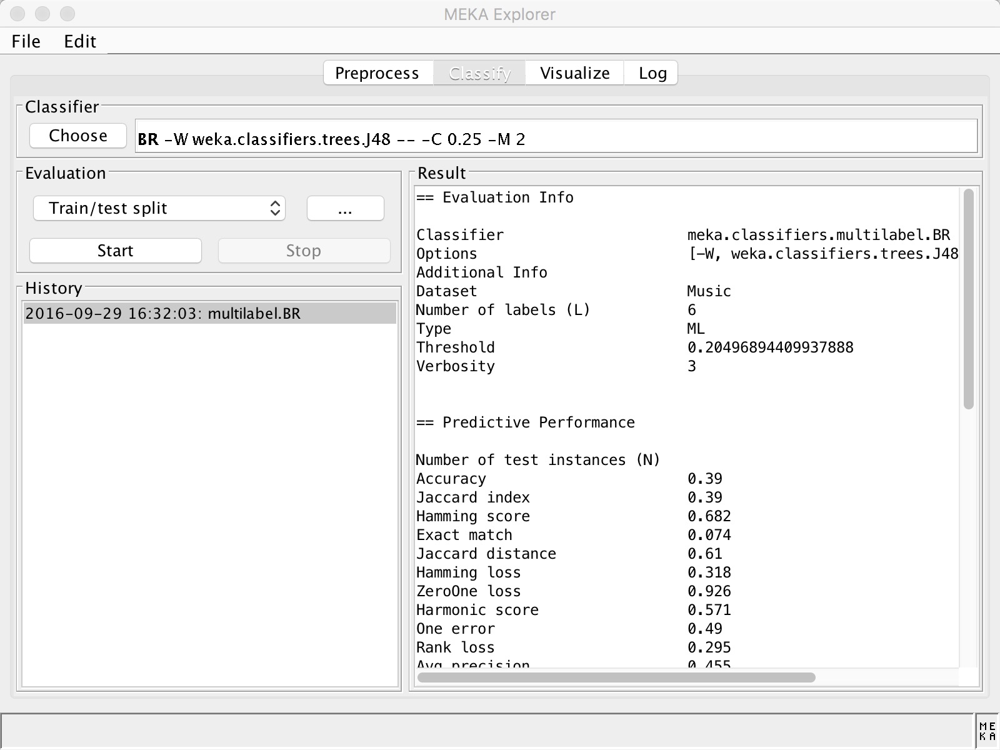

&#160; &#160; &#160; &#160;乍一看题目，使用"**meka**"实现分类器，是不是笔者打错了啊，应该是weka啊。其实不然，这世上还真有一个叫meka的包，并且他还跟weka算是亲戚关系。只不过，这个meka是一个专门用来解决多标签分类问题的包，并且是基于weka的，可以算作是weka的一个扩展。   
&#160; &#160; &#160; &#160;那好，什么是多标签分类呢？我们先来看一个示例：如果我有一篇文章，我要推断它是不是“体育”类新闻，那么分类标签就只有**“是”**或者**“不是”**，这种问题就是经典的二分类**(binary classifier)**问题。好，再复杂一点，如果我们要判断这篇文章是属于“体育”、“财经”、“社会”中的哪一类？那么这个问题就变成了一个多类分类问题**(multiclass classifier)**，注意，对于每篇文章它只能属于“体育”、“财经”、“社会”中的**某一类**，不能属于多个类。也就是我们的样本的标签可以是\[0,0,1\]或者\[0,1,0\]或者\[1,0,0\]，但绝不可能是\[1,1,0\]或者\[1,0,1\]等。好了，与多分类对应的就是多标签分类**(multilabel classifier)**，它是解决什么问题的呢？如果一篇文章，它既能属于“体育”类，又能属于“财经类”，甚至还能属于“社会”类，也就是我们待分类的文章有可能同时分到多个类中去，对于这样的分类我们就叫多标签分类。 
&#160; &#160; &#160; &#160;明白了多标签分类的概念，我们怎么实现呢？其实说到底，多类分类，多标签分类，其实底层都是二分类组合。我们当然可以自己手动实现。但有没有已有的库来帮助我们实现呢？当然有！！！[sklearn](http://scikit-learn.org/stable/modules/multiclass.html)中已经有实现多标签分类的方法了，它的底层支持可以是Decision Trees, Random Forests以及Nearest Neighbors. 不过我们这次不使用我们优雅的sklearn，要跳到JAVA的坑去（好桑心）。JAVA中比较有名的多标签分类包是[mulan](http://mulan.sourceforge.net/)以及meka,我们今天只讲meka，至于mulan的实现方法其实也跟meka很像，甚至在meka中都已经集成了mulan的jar包。
&#160; &#160; &#160; &#160;[meka](http://meka.sourceforge.net/)是由三个大牛Jesse Read、Peter Reutemann、Joerg Wicker实现，并且现在已经开源到[github](https://github.com/Waikato/meka)了，与weka其实是师出同门。meka的使用基本与weka一致，它甚至到包含一个客户端，长相也跟weka很像。
 对于图形界面的使用，可以去看看它们的[官方教程](https://sourceforge.net/projects/meka/files/meka-1.9.0/Tutorial.pdf)，很详细。我们今天来说一说如何使用集成meka-1.9.0.jar来进行编程实现。这个jar包存在于lib文件夹下。
&#160; &#160; &#160; &#160;meka也是用arff文件作为输入。官方文档中有这么一句话："A suitable dataset is the only requirement to begin running experiments with Meka.",足见meka使用之方便~~ meka中已经自带了几个用于实现多标签分类的数据集在data目录下，这个数据集是描述某段音频的特征，以及它们属于哪些分类（是悲伤类的还是安静类的亦或是疯狂摇滚的...）我们来看看大概看看，每行%后面是我自己加的注释： 
```
% 'Music' dataset; normalised version.
@relation 'Music: -C 6'                       %代表标签一共有6类

@attribute amazed-suprised {0,1}              %第一个分类标签，取值是0或者1，代表是或者不是
@attribute happy-pleased {0,1}                %第二个分类标签
@attribute relaxing-clam {0,1}                %第三个分类标签
@attribute quiet-still {0,1}                  %第四个分类标签
@attribute sad-lonely {0,1}                   %第五个分类标签
@attribute angry-aggresive {0,1}              %第六个分类标签
@attribute Mean_Acc1298_Mean_Mem40_Centroid numeric  %第一个特征，numeric类型
@attribute Mean_Acc1298_Mean_Mem40_Rolloff numeric   %第二个特征，numeric类型
@attribute Mean_Acc1298_Mean_Mem40_Flux numeric      %第三个特征，numeric类型
@attribute Mean_Acc1298_Mean_Mem40_MFCC_0 numeric    %第四个特征，numeric类型
@attribute Mean_Acc1298_Mean_Mem40_MFCC_1 numeric    %第五个特征，numeric类型
@attribute Mean_Acc1298_Mean_Mem40_MFCC_2 numeric    %第六个特征，numeric类型
@attribute Mean_Acc1298_Mean_Mem40_MFCC_3 numeric    %第七个特征，numeric类型
@attribute Mean_Acc1298_Mean_Mem40_MFCC_4 numeric    %第八个特征，numeric类型
@attribute Mean_Acc1298_Mean_Mem40_MFCC_5 numeric    %第九个特征，numeric类型
....
@data

0,1,1,0,0,0,0.132498,0.077848,0.229227,0.602629,0.512861,0.467404,0.529733,0.573498,0.592831,0.520031,0.598853,0.537699,0.780658,0.462982,0.407108,0.684364,0.135824,0.245631,0.157515,0.301285,0.350107,0.459476,0.583274,0.430053,0.416198,0.581916,0.342758,0.309345,0.388929,0.323521,0.455207,0.26139,0.027559,0.149077,0.195433,0.571354,0.326404,0.246745,0.524645,0.354798,0.240244,0.239788,0.128689,0.173252,0.204863,0.131632,0.245653,0.144607,0.258203,0.470051,0.259909,0.61364,0.458314,0.434716,0.448941,0.370609,0.285647,0.663082,0.29708,0.273671,0.286411,0.197026,0.196244,0.164323,0.030017,0.253968,0.008473,0.240602,0.136735,0.058442,0.107594  %第一条数据
1,0,0,0,0,1,0.384281,0.355249,0.16719,0.853089,0.260577,0.332757,0.15393,0.519381,0.268043,0.251955,0.459922,0.430814,0.654323,0.641021,0.356511,0.647367,0.367659,0.539078,0.100569,0.133502,0.337194,0.319752,0.349012,0.171182,0.191357,0.390569,0.289253,0.208641,0.341328,0.265669,0.273736,0.181791,0.028513,0.252827,0.25819,0.011351,0.236247,0.069285,0.192754,0.154258,0.128671,0.116726,0.059704,0.073697,0.080341,0.062701,0.075672,0.041256,0.207782,0.300735,0.888274,0.444,0.294673,0.210429,0.132036,0.167474,0.205996,0.155514,0.086631,0.071462,0.067492,0.093526,0.085649,0.025101,0.182955,0.285714,0.156764,0.270677,0.191377,0.153728,0.197951  %第二条数据
```
与weka有点区别的是，对于标签在每个样本集中的位置，weka一般是放在每行末尾，虽然可以放在每行的任意位置，可以通过Instances.setClassIndex(n)方法，来指定每行的第n位是属于分类标签。 先来上代码吧： 
```java
import meka.classifiers.multilabel.BR;
import weka.classifiers.bayes.NaiveBayesMultinomialUpdateable;
import weka.core.Instances;
import weka.core.converters.ArffLoader;

import java.io.File;

/**
 * @author ayonel
 * @created_at 16/9/27
 */

public class YYRec {
    public static void main(String[] args) throws Exception{
        ArffLoader loader = new ArffLoader();
        loader.setFile(new File("testdata/Music.arff")); //读取测试集
        loader.getStructure();
        
        Instances originDataSet = loader.getDataSet(); //获取测试集
        originDataSet.setClassIndex(6); //这一步是指定前6个元素作为分类标签
        BR br = new BR(); //建立分类器
        br.buildClassifier(originDataSet);//开始训练
        double [] result = br.distributionForInstance(originDataSet.instance(0));//对训练集中的第一个实例进行预测
        //输出每个标签的预测结果（为1的概率值）
        for(int i=0; i<result.length; i++) {
            System.out.println(result[i]);
        }
    }
}
```
输出结果：
```
0.0
1.0
0.9859154929577465
0.034482758620689655
0.0
0.013452914798206279
```
甚至还可以使用多标签分类进行增量学习，使用：
meka.classifiers.multilabel.incremental.BRUpdateable类，该类底层使用weka.classifiers.trees.HoeffdingTree来实现。