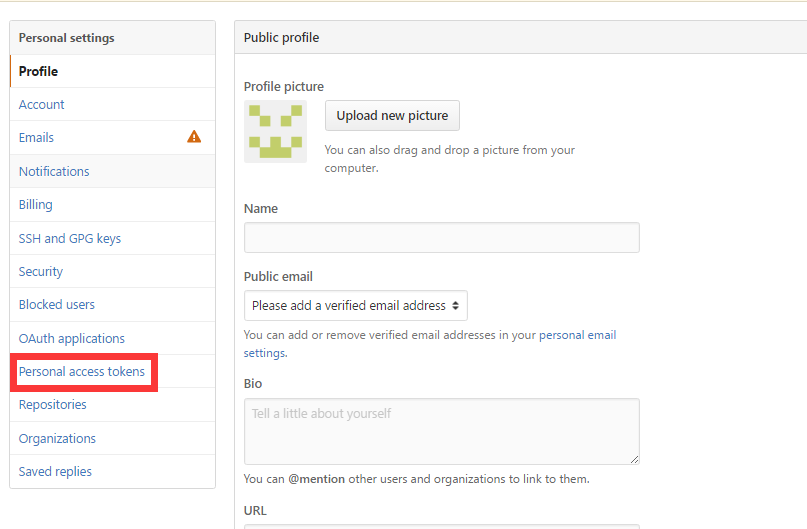
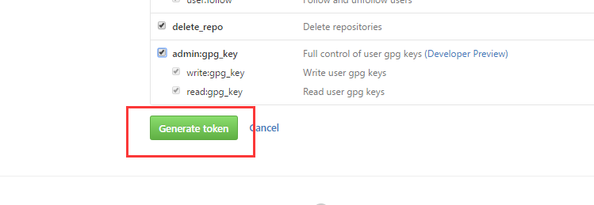
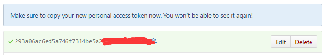

&#160; &#160; &#160; &#160;**GitHub API**其实是一座宝藏，它拥有着海量项目以及开发者的各类信息，可以作为社交编程以及经验软件工程课题的数据载体。

&#160; &#160; &#160; &#160;本次教程教大家如何使用scrapy来爬取GitHub API，抓取我们所需要的特定信息。GitHub API 是GitHub基于**OAuth2**协议开放出来的数据获取接口，我们能够在GitHub API上获取各类信息，比如一个项目的_commit,issue,pull request_;一个用户的粉丝，关注，提交活动，评论等等。GitHub API 有着详细的[官方文档教程](https://api.github.com),上面各类数据的获取接口地址，以及一些过滤参数等。本教程将以爬取[rails](http://github.com/rails/rails)的issue信息为例，教大家如何使用**_scrapy_**来爬取GitHub API。
&#160; &#160; &#160; &#160;在开始爬取之前，我们需要进行一些准备工作，由于**GitHub API**采用**OAuth2**认证，需要我们提供认证token。当然不提供token可以进行爬取，但是爬取速率会大大降低。
&#160; &#160; &#160; &#160;**_For requests using Basic Authentication or OAuth, you can make up to 5,000 requests per hour. For unauthenticated requests, the rate limit allows you to make up to 60 requests per hour. Unauthenticated requests are associated with your IP address, and not the user making requests. Note that the Search API has custom rate limit rules._**
&#160; &#160; &#160; &#160;上面显示如果我们提供token可以每小时进行**5000**次请求，对于非认证(不提供token)一小时只能提供**60**次的请求，超出请求速率限制后，会返回状态码**403 forbidden**。有人会问，即使认证后**5000次/小时**的速率也有些慢啊，如果要更快地进行爬取，那就多注册几个GitHub账号，同时利用多个账号的token进行爬取。GitHub的爬取限制针对的是每个用户，而不是**IP**，也就是同一台机器，只要你保证每个账号每小时进行小于5000次的爬取，也是完全没有问题的。
&#160; &#160; &#160; &#160;接下来我们来展示如何获取自己的token，其实全名为personal access token，每个账号可以拥有多个token，所以不小心哪一天忘了的话，重新生成一个新的即可。 首先我们需要登录自己的GitHub账号。然后在设置里面有一个_personal access token_选项：
 点进去，再点击**Generate new token** . 选择你想让你的token拥有的权限，一般默认全选即可。点击绿色的Generate token按钮。
 这样就生成我们的token了。注意一定要在这时候把token保存下来，这将是你在GitHub上最后一次看见你的token。一旦刷新，token就会隐藏掉。这时候只有生成新的token了。
 
&#160; &#160; &#160; &#160;好了，有了预先的准备工作，接下来就可以编写爬虫了。这次爬虫采用scrapy，关于scrapy相关的知识就不再赘述了，网上有很多教程。 
&#160; &#160; &#160; &#160;简单说一下爬取思路。 GitHub API 返回的数据都是json，这极大地方便了数据的解析。我们本次的任务是爬取rails项目的所有issue,先来大概看一下返回的issue是什么样子。由于内容太长，我就直接放链接，大家可以点击去看。
[https://api.github.com/repos/rails/rails/issues](https://api.github.com/repos/rails/rails/issues)
&#160; &#160; &#160; &#160;我们可以看到返回的页面是一个json数组，每个元素其实就是一个issue.而每个issue里面又有诸多信息，比如number,title,body等等。我们本次任务就爬取rails所有issue的信息number，提交者(user.login)，body以及title.
&#160; &#160; &#160; &#160;注意，[https://api.github.com/repos/rails/rails/issues](https://api.github.com/repos/rails/rails/issues)返回的是按时间倒叙排列的issue,并且每页默认返回30条，我们需要在url后面接上一些参数，来爬取指定的页。我们将url接上参数构造成如下的样子：
`https://api.github.com/repos/rails/rails/issues?per_page=99&page=num`
&#160; &#160; &#160; &#160;其中num代表页数，我们需要从1开始自增。per_page代表每页返回的元素个数,GitHub最大只能指定到99。
&#160; &#160; &#160; &#160;所以我们的爬虫，应该是从1开始不停地自增num，直到返回的json数组元素个数不足99，就说明爬取完了。另外，由于GitHub API 爬取速率的限制，我事先准备了10个不同账号的token,对于每次请求，重新自定义请求header,带上不同的token. 
下文是源代码：
```
# -*- coding: utf-8 -*-
__author__ = 'ayonel'
import itertools
import json
import os
import scrapy
from scrapy import Request

class IssueSpider(scrapy.spiders.Spider):

    name = "issue" #爬虫名称
    allowed_domains = ["github.com"] #制定爬取域名
    num = 1 # 页数，默认从第一页开始
    handle_httpstatus_list = [404, 403, 401] #如果返回这个列表中的状态码，爬虫也不会终止
    output_file = open('issue.txt', "a") #输出文件
    #token列表，隐去部分
    token_list = [
        '293a06ac6ed5a746f7314be5a25f3d**********',
        '66de084042a7d3311544c656ad9273**********',
        'a513f61368e16c2da229e38e139a8e**********',
        '9055150c8fd031468af71cbb4e12c5**********',
        'ba119dc83af804327fa9dad8e07718**********',
        'b93e6996a4d76057d16e5e45788fbf**********',
        'c9c13e5c14d6876c76919520c9b05d**********',
        '3e41cbfc0c8878aec935fba68a0d3c**********',
        '402ff55399ca08ca7c886a2031f49f**********',
        '7cb6e20a24000968983b79b5de705c**********',
    ]
    token_iter = itertools.cycle(token_list) #生成循环迭代器，迭代到最后一个token后，会重新开始迭代


    def __init__(self): #初始化
        scrapy.spiders.Spider.__init__(self)

    def __del__(self): #爬虫结束时，关闭文件
        self.output_file.close()

    def start_requests(self):
        start_urls = [] #初始爬取链接列表
        url = "https://api.github.com/repos/rails/rails/issues?per_page=99&page="+str(self.num) #第一条爬取url
        #添加一个爬取请求
        start_urls.append(scrapy.FormRequest(url, headers={
            'User-Agent': 'Mozilla/5.0 (Windows NT 6.1; WOW64; rv:36.0) Gecko/20100101 Firefox/36.0',
            'Accept': 'text/html,application/xhtml+xml,application/xml;q=0.9,*/*;q=0.8',
            'Accept-Language': 'en',
            'Authorization': 'token ' + self.token_iter.next(),#这个字段为添加token字段
            }, callback=self.parse)) 

        return start_urls

    def yield_request(self): #定义一个生成请求函数
        url = "https://api.github.com/repos/rails/rails/issues?per_page=99&page="+str(self.num) #生成url
        #返回请求
        return Request(url,headers={
                'User-Agent': 'Mozilla/5.0 (Windows NT 6.1; WOW64; rv:36.0) Gecko/20100101 Firefox/36.0',
                'Accept': 'text/html,application/xhtml+xml,application/xml;q=0.9,*/*;q=0.8',
                'Accept-Language': 'en',
                'Authorization': 'token ' + self.token_iter.next(),
                },callback=self.parse)

    #解析函数
    def parse(self, response):
        if response.status in self.handle_httpstatus_list:#如果遇见handle_httpstatus_list中出现的状态码
            self.num += 1 #num自增，相当于直接跳过，可以输出当前url到log文件
            yield self.yield_request() #产生新的请求
            return

        json_data = json.loads(response.body_as_unicode()) #获取json
        length = len(json_data) #获取json长度

        if length == 99:
            self.num = self.num + 1
            for issue in json_data:
                data = {}
                data['number'] = issue['number']
                data['owner'] = issue['user']['login']
                data['title'] = issue['title']
                data['body'] = issue['body']
               
                self.output_file.write(json.dumps(data)+'\n') #输出每一行，格式也为json
            self.output_file.flush()
            yield self.yield_request() #产生新的请求

        elif length < 99: #意味着爬取到最后一页
            for issue in json_data:
               data = {}
                data['number'] = issue['number']
                data['owner'] = issue['user']['login']
                data['title'] = issue['title']
                data['body'] = issue['body']
                self.output_file.write(json.dumps(data)+'\n')
            self.output_file.flush()
```