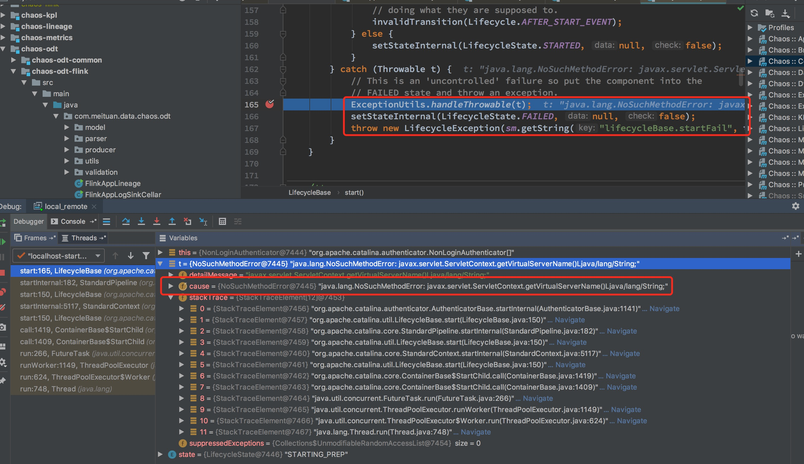
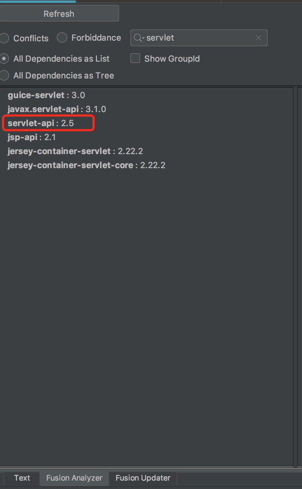
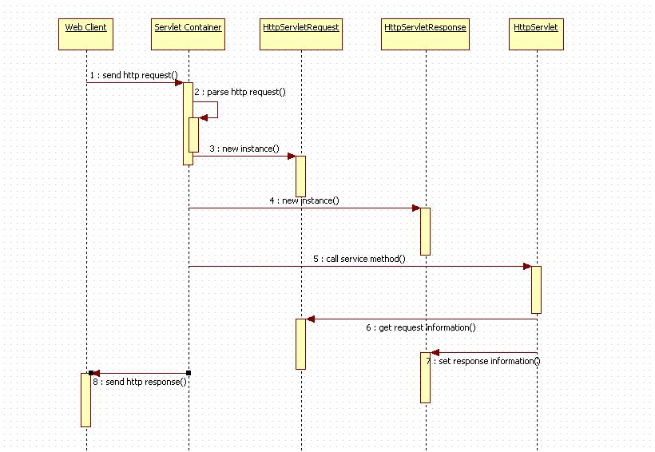
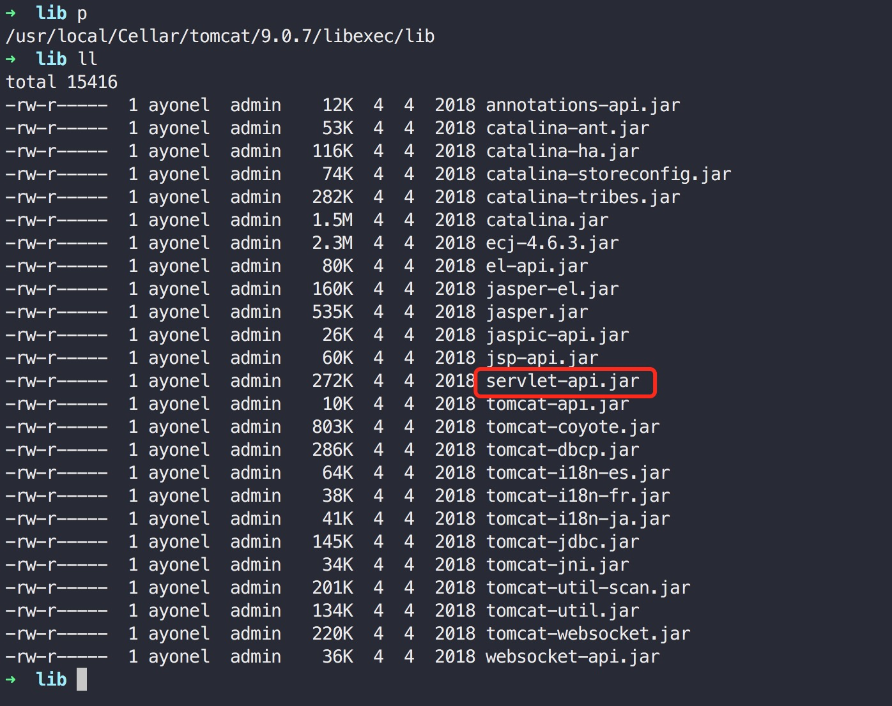
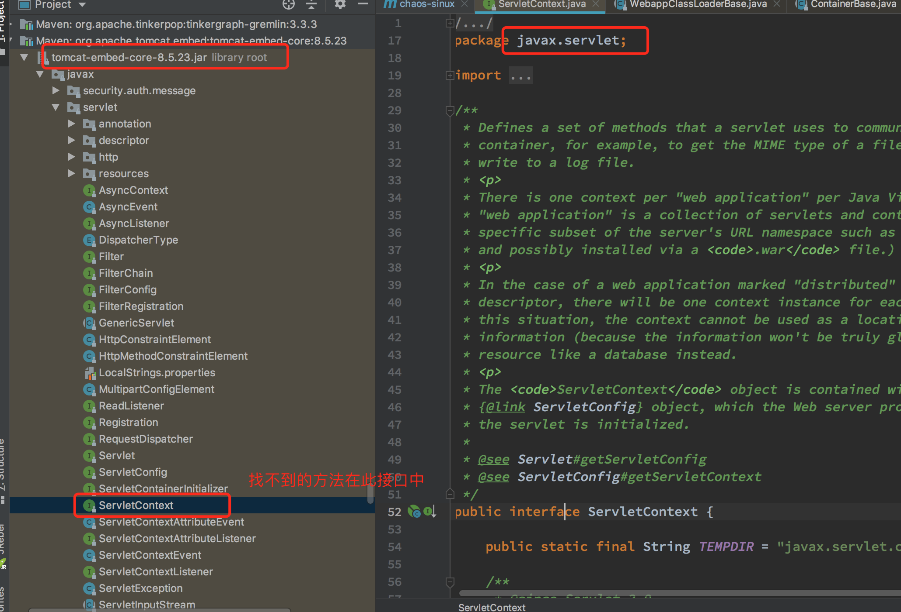
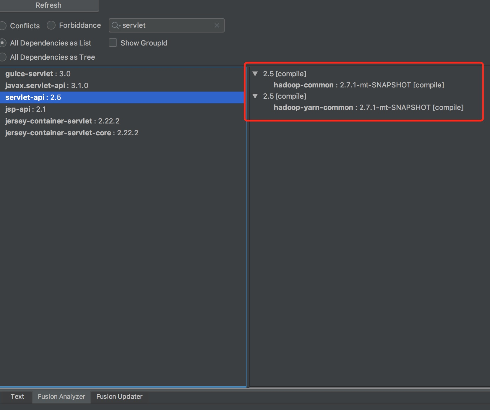
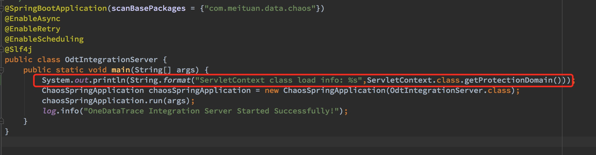
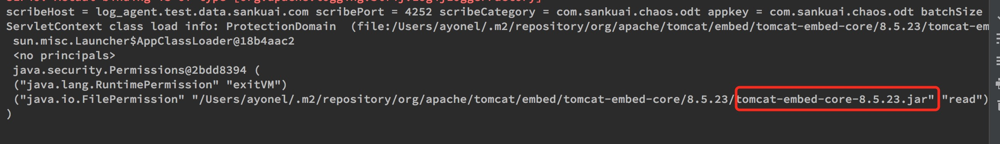
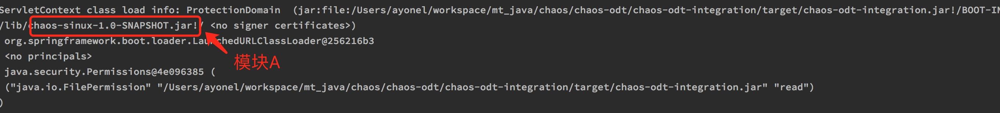

# 背景

最近同事在开发时遇到一个比较诡异的问题：
1. 在项目打包好之后启动时，报
`org.apache.catalina.LifecycleException: A child container failed during start`

这个错误，且从日志中找不到任何额外的有用出错信息。
2. 奇怪的是在IDEA中直接启动项目，居然能成功启动，无法复现。
> 我们的项目是一个标准的基于maven的多模块springboot项目，使用内嵌tomcat

完整报错堆栈如下：
```$java
2020/08/16 21:26:54.561 main [ERROR] SpringApplication (SpringApplication.java:771) Application startup failed
org.springframework.context.ApplicationContextException: Unable to start embedded container; nested exception is org.springframework.boot.context.embedded.EmbeddedServletContainerException: Unable to start embedded Tomcat
        at org.springframework.boot.context.embedded.EmbeddedWebApplicationContext.onRefresh(EmbeddedWebApplicationContext.java:137) ~[spring-boot-1.5.9.RELEASE.jar!/:1.5.9.RELEASE]
        at org.springframework.context.support.AbstractApplicationContext.refresh(AbstractApplicationContext.java:537) ~[spring-context-4.3.13.RELEASE.jar!/:4.3.13.RELEASE]
        at org.springframework.boot.context.embedded.EmbeddedWebApplicationContext.refresh(EmbeddedWebApplicationContext.java:122) ~[spring-boot-1.5.9.RELEASE.jar!/:1.5.9.RELEASE]
        at org.springframework.boot.SpringApplication.refresh(SpringApplication.java:693) [spring-boot-1.5.9.RELEASE.jar!/:1.5.9.RELEASE]
        at org.springframework.boot.SpringApplication.refreshContext(SpringApplication.java:360) [spring-boot-1.5.9.RELEASE.jar!/:1.5.9.RELEASE]
        at org.springframework.boot.SpringApplication.run(SpringApplication.java:303) [spring-boot-1.5.9.RELEASE.jar!/:1.5.9.RELEASE]
        at com.meituan.data.chaos.odt.integration.OdtIntegrationServer.main(OdtIntegrationServer.java:22) [classes!/:0.0.1-SNAPSHOT]
        at sun.reflect.NativeMethodAccessorImpl.invoke0(Native Method) ~[?:1.8.0_161]
        at sun.reflect.NativeMethodAccessorImpl.invoke(NativeMethodAccessorImpl.java:62) ~[?:1.8.0_161]
        at sun.reflect.DelegatingMethodAccessorImpl.invoke(DelegatingMethodAccessorImpl.java:43) ~[?:1.8.0_161]
        at java.lang.reflect.Method.invoke(Method.java:498) ~[?:1.8.0_161]
        at org.springframework.boot.loader.MainMethodRunner.run(MainMethodRunner.java:48) [chaos-odt-integration.jar:0.0.1-SNAPSHOT]
        at org.springframework.boot.loader.Launcher.launch(Launcher.java:87) [chaos-odt-integration.jar:0.0.1-SNAPSHOT]
        at org.springframework.boot.loader.Launcher.launch(Launcher.java:50) [chaos-odt-integration.jar:0.0.1-SNAPSHOT]
        at org.springframework.boot.loader.JarLauncher.main(JarLauncher.java:51) [chaos-odt-integration.jar:0.0.1-SNAPSHOT]
Caused by: org.springframework.boot.context.embedded.EmbeddedServletContainerException: Unable to start embedded Tomcat
        at org.springframework.boot.context.embedded.tomcat.TomcatEmbeddedServletContainer.initialize(TomcatEmbeddedServletContainer.java:123) ~[spring-boot-1.5.9.RELEASE.jar!/:1.5.9.RELEASE]
        at org.springframework.boot.context.embedded.tomcat.TomcatEmbeddedServletContainer.<init>(TomcatEmbeddedServletContainer.java:84) ~[spring-boot-1.5.9.RELEASE.jar!/:1.5.9.RELEASE]
        at org.springframework.boot.context.embedded.tomcat.TomcatEmbeddedServletContainerFactory.getTomcatEmbeddedServletContainer(TomcatEmbeddedServletContainerFactory.java:554) ~[spring-boot-1.5.9.RELEASE.jar!/:1.5.9.RELEASE]
        at org.springframework.boot.context.embedded.tomcat.TomcatEmbeddedServletContainerFactory.getEmbeddedServletContainer(TomcatEmbeddedServletContainerFactory.java:179) ~[spring-boot-1.5.9.RELEASE.jar!/:1.5.9.RELEASE]
        at org.springframework.boot.context.embedded.EmbeddedWebApplicationContext.createEmbeddedServletContainer(EmbeddedWebApplicationContext.java:164) ~[spring-boot-1.5.9.RELEASE.jar!/:1.5.9.RELEASE]
        at org.springframework.boot.context.embedded.EmbeddedWebApplicationContext.onRefresh(EmbeddedWebApplicationContext.java:134) ~[spring-boot-1.5.9.RELEASE.jar!/:1.5.9.RELEASE]
        ... 14 more
Caused by: org.apache.catalina.LifecycleException: Failed to start component [StandardServer[-1]]
        at org.apache.catalina.util.LifecycleBase.start(LifecycleBase.java:167) ~[tomcat-embed-core-8.5.23.jar!/:8.5.23]
        at org.apache.catalina.startup.Tomcat.start(Tomcat.java:367) ~[tomcat-embed-core-8.5.23.jar!/:8.5.23]
        at org.springframework.boot.context.embedded.tomcat.TomcatEmbeddedServletContainer.initialize(TomcatEmbeddedServletContainer.java:99) ~[spring-boot-1.5.9.RELEASE.jar!/:1.5.9.RELEASE]
        at org.springframework.boot.context.embedded.tomcat.TomcatEmbeddedServletContainer.<init>(TomcatEmbeddedServletContainer.java:84) ~[spring-boot-1.5.9.RELEASE.jar!/:1.5.9.RELEASE]
        at org.springframework.boot.context.embedded.tomcat.TomcatEmbeddedServletContainerFactory.getTomcatEmbeddedServletContainer(TomcatEmbeddedServletContainerFactory.java:554) ~[spring-boot-1.5.9.RELEASE.jar!/:1.5.9.RELEASE]
        at org.springframework.boot.context.embedded.tomcat.TomcatEmbeddedServletContainerFactory.getEmbeddedServletContainer(TomcatEmbeddedServletContainerFactory.java:179) ~[spring-boot-1.5.9.RELEASE.jar!/:1.5.9.RELEASE]
        at org.springframework.boot.context.embedded.EmbeddedWebApplicationContext.createEmbeddedServletContainer(EmbeddedWebApplicationContext.java:164) ~[spring-boot-1.5.9.RELEASE.jar!/:1.5.9.RELEASE]
        at org.springframework.boot.context.embedded.EmbeddedWebApplicationContext.onRefresh(EmbeddedWebApplicationContext.java:134) ~[spring-boot-1.5.9.RELEASE.jar!/:1.5.9.RELEASE]
        ... 14 more
Caused by: org.apache.catalina.LifecycleException: Failed to start component [StandardService[Tomcat]]
        at org.apache.catalina.util.LifecycleBase.start(LifecycleBase.java:167) ~[tomcat-embed-core-8.5.23.jar!/:8.5.23]
        at org.apache.catalina.core.StandardServer.startInternal(StandardServer.java:793) ~[tomcat-embed-core-8.5.23.jar!/:8.5.23]
        at org.apache.catalina.util.LifecycleBase.start(LifecycleBase.java:150) ~[tomcat-embed-core-8.5.23.jar!/:8.5.23]
        at org.apache.catalina.startup.Tomcat.start(Tomcat.java:367) ~[tomcat-embed-core-8.5.23.jar!/:8.5.23]
        at org.springframework.boot.context.embedded.tomcat.TomcatEmbeddedServletContainer.initialize(TomcatEmbeddedServletContainer.java:99) ~[spring-boot-1.5.9.RELEASE.jar!/:1.5.9.RELEASE]
        at org.springframework.boot.context.embedded.tomcat.TomcatEmbeddedServletContainer.<init>(TomcatEmbeddedServletContainer.java:84) ~[spring-boot-1.5.9.RELEASE.jar!/:1.5.9.RELEASE]
        at org.springframework.boot.context.embedded.tomcat.TomcatEmbeddedServletContainerFactory.getTomcatEmbeddedServletContainer(TomcatEmbeddedServletContainerFactory.java:554) ~[spring-boot-1.5.9.RELEASE.jar!/:1.5.9.RELEASE]
        at org.springframework.boot.context.embedded.tomcat.TomcatEmbeddedServletContainerFactory.getEmbeddedServletContainer(TomcatEmbeddedServletContainerFactory.java:179) ~[spring-boot-1.5.9.RELEASE.jar!/:1.5.9.RELEASE]
        at org.springframework.boot.context.embedded.EmbeddedWebApplicationContext.createEmbeddedServletContainer(EmbeddedWebApplicationContext.java:164) ~[spring-boot-1.5.9.RELEASE.jar!/:1.5.9.RELEASE]
        at org.springframework.boot.context.embedded.EmbeddedWebApplicationContext.onRefresh(EmbeddedWebApplicationContext.java:134) ~[spring-boot-1.5.9.RELEASE.jar!/:1.5.9.RELEASE]
        ... 14 more
Caused by: org.apache.catalina.LifecycleException: Failed to start component [StandardEngine[Tomcat]]
        at org.apache.catalina.util.LifecycleBase.start(LifecycleBase.java:167) ~[tomcat-embed-core-8.5.23.jar!/:8.5.23]
        at org.apache.catalina.core.StandardService.startInternal(StandardService.java:422) ~[tomcat-embed-core-8.5.23.jar!/:8.5.23]
        at org.apache.catalina.util.LifecycleBase.start(LifecycleBase.java:150) ~[tomcat-embed-core-8.5.23.jar!/:8.5.23]
        at org.apache.catalina.core.StandardServer.startInternal(StandardServer.java:793) ~[tomcat-embed-core-8.5.23.jar!/:8.5.23]
        at org.apache.catalina.util.LifecycleBase.start(LifecycleBase.java:150) ~[tomcat-embed-core-8.5.23.jar!/:8.5.23]
        at org.apache.catalina.startup.Tomcat.start(Tomcat.java:367) ~[tomcat-embed-core-8.5.23.jar!/:8.5.23]
        at org.springframework.boot.context.embedded.tomcat.TomcatEmbeddedServletContainer.initialize(TomcatEmbeddedServletContainer.java:99) ~[spring-boot-1.5.9.RELEASE.jar!/:1.5.9.RELEASE]
        at org.springframework.boot.context.embedded.tomcat.TomcatEmbeddedServletContainer.<init>(TomcatEmbeddedServletContainer.java:84) ~[spring-boot-1.5.9.RELEASE.jar!/:1.5.9.RELEASE]
        at org.springframework.boot.context.embedded.tomcat.TomcatEmbeddedServletContainerFactory.getTomcatEmbeddedServletContainer(TomcatEmbeddedServletContainerFactory.java:554) ~[spring-boot-1.5.9.RELEASE.jar!/:1.5.9.RELEASE]
        at org.springframework.boot.context.embedded.tomcat.TomcatEmbeddedServletContainerFactory.getEmbeddedServletContainer(TomcatEmbeddedServletContainerFactory.java:179) ~[spring-boot-1.5.9.RELEASE.jar!/:1.5.9.RELEASE]
        at org.springframework.boot.context.embedded.EmbeddedWebApplicationContext.createEmbeddedServletContainer(EmbeddedWebApplicationContext.java:164) ~[spring-boot-1.5.9.RELEASE.jar!/:1.5.9.RELEASE]
        at org.springframework.boot.context.embedded.EmbeddedWebApplicationContext.onRefresh(EmbeddedWebApplicationContext.java:134) ~[spring-boot-1.5.9.RELEASE.jar!/:1.5.9.RELEASE]
        ... 14 more
Caused by: org.apache.catalina.LifecycleException: A child container failed during start
        at org.apache.catalina.core.ContainerBase.startInternal(ContainerBase.java:948) ~[tomcat-embed-core-8.5.23.jar!/:8.5.23]
        at org.apache.catalina.core.StandardEngine.startInternal(StandardEngine.java:262) ~[tomcat-embed-core-8.5.23.jar!/:8.5.23]
        at org.apache.catalina.util.LifecycleBase.start(LifecycleBase.java:150) ~[tomcat-embed-core-8.5.23.jar!/:8.5.23]
        at org.apache.catalina.core.StandardService.startInternal(StandardService.java:422) ~[tomcat-embed-core-8.5.23.jar!/:8.5.23]
        at org.apache.catalina.util.LifecycleBase.start(LifecycleBase.java:150) ~[tomcat-embed-core-8.5.23.jar!/:8.5.23]
        at org.apache.catalina.core.StandardServer.startInternal(StandardServer.java:793) ~[tomcat-embed-core-8.5.23.jar!/:8.5.23]
        at org.apache.catalina.util.LifecycleBase.start(LifecycleBase.java:150) ~[tomcat-embed-core-8.5.23.jar!/:8.5.23]
        at org.apache.catalina.startup.Tomcat.start(Tomcat.java:367) ~[tomcat-embed-core-8.5.23.jar!/:8.5.23]
        at org.springframework.boot.context.embedded.tomcat.TomcatEmbeddedServletContainer.initialize(TomcatEmbeddedServletContainer.java:99) ~[spring-boot-1.5.9.RELEASE.jar!/:1.5.9.RELEASE]
        at org.springframework.boot.context.embedded.tomcat.TomcatEmbeddedServletContainer.<init>(TomcatEmbeddedServletContainer.java:84) ~[spring-boot-1.5.9.RELEASE.jar!/:1.5.9.RELEASE]
        at org.springframework.boot.context.embedded.tomcat.TomcatEmbeddedServletContainerFactory.getTomcatEmbeddedServletContainer(TomcatEmbeddedServletContainerFactory.java:554) ~[spring-boot-1.5.9.RELEASE.jar!/:1.5.9.RELEASE]
        at org.springframework.boot.context.embedded.tomcat.TomcatEmbeddedServletContainerFactory.getEmbeddedServletContainer(TomcatEmbeddedServletContainerFactory.java:179) ~[spring-boot-1.5.9.RELEASE.jar!/:1.5.9.RELEASE]
        at org.springframework.boot.context.embedded.EmbeddedWebApplicationContext.createEmbeddedServletContainer(EmbeddedWebApplicationContext.java:164) ~[spring-boot-1.5.9.RELEASE.jar!/:1.5.9.RELEASE]
        at org.springframework.boot.context.embedded.EmbeddedWebApplicationContext.onRefresh(EmbeddedWebApplicationContext.java:134) ~[spring-boot-1.5.9.RELEASE.jar!/:1.5.9.RELEASE]
        ... 14 more
```
从完整报错堆栈出可以看出，该报错堆栈确实无法直接看出问题的本质，这个问题确实有点意思~

# 分析

STEP1. 经过简单地google，有不少类似的问题，但人家的报错堆栈都比较完整，能直接定位到问题代码，一般为tomcat启动过程中jar包冲突。<br>  
STEP2. 经同事提供的信息，最近该模块（为方便起见，下文对该模块统称为模块B）有新引入其他模块（为方便起见，下文对该模块统称为模块A），且取消对模块A的依赖后，模块B可以正常启动（大概率jar包冲突）。 <br> 
因此问题有了一个明确一点的方向：肯定是A模块带来的某个冲突的依赖，导致了该问题。<br>
***但如何能定位出到底是哪一个依赖，却是一件比较繁琐的事***

# 如何解决

## 思路一
最笨的方法便是逐个排除模块A中的依赖，确定到某个依赖项之后，如果该依赖还有二级依赖，还需要继续深入排查。另外如果模块A依赖项较多，整个排查成本线性升高，因此暂时不考虑该方法。

## 思路二
既然报错堆栈未能展示出更有用的信息，肯定是tomcat内部吞掉了真正的异常。那就朝这个方向出发，即让tomcat在启动时能够打出更完整的日志。
从spring官网查阅，通过如下配置：
```$properties
logging.level.org.apache.tomcat=DEBUG
logging.level.org.apache.catalina=DEBUG
```
可让tomcat在DEBUG level下打印服务器内部异常。
但遗憾的是，可能是因为我们的springboot版本比较低的缘故（1.5.9.RELEASE）,该配置未能生效，排查再一次陷入僵局。

## 思路三
如果能够DEBUG整个启动过程，即使是单步调试一行行追下去，也能定位到真正出错的那一行，那么问题也就迎刃而解了。<br>
但难受的时，IDEA直接启动我们项目时，是能正常启动的，不会报错，简直坑爹。<br>
还是那句老话`山重水复疑无路，柳暗花明又一村`。突然一道灵光乍现，一个骚操作出现在脑海中。<br>
能否用IDEA远程调试功能，将项目打包后，在本地启动时，利用IDEA远程调试连接本地JVM进程进行调试。springboot内嵌的tomcat在启动前需要进行一系列操作，如类加载等等。我们提前在报错上下文处的代码打上断点，就可拦截住启动线程，从而进行调试。<br>
那就梭哈一把吧，奥利给。<br>

+ 将项目进行打包：
 ```
  mvn clean package -pl chaos-odt/chaos-odt-integration -am -Dmaven.test.skip=true
 ```
+ 提前在IDEA中配置好远程调试，并在报错的代码出提前打上断点。如何配置远程调试具体很简单，可参考: [使用IDEA进行远程调试](https://www.jianshu.com/p/302dc10217c0)

+ 启动项目，并开启jdwp远程调试：
```
 java -jar -Xdebug -Xrunjdwp:transport=dt_socket,suspend=n,server=y,address=5555 chaos-odt/chaos-odt-integration/target/chaos-odt-integration.jar
```
上述命令以debug模式启动项目，并暴露出5555端口，以便让其他进程通过jdwp协议进行调试。

+ 手快一点切回IDEA, 点击DEBUG按钮，然后就静静等待即可。

经过一番调试，终于找到了那一行~



从上述截图中我们可以看出来：
1. 确实是tomcat 包装了真正的异常。
2. 实际出错原因是`java.lang.NoSuchMethodError: javax.servlet.ServletContext.getVirtualServerName()Ljava/lang/String;`
很典型的jar包冲突导致的问题。

可以看出来该方法是javax中的方法，且搜索代码定位到了属于servlet-api这个jar包，且我们实际引入的该jar包的版本为2.5。


# Servlet与Tomcat
虽然我们定位到了是servlet-api这个jar包冲突，项目中实际加载的是2.5版本，版本太低，不存在tomcat需要的某个方法

但我们是应该升级该包，还是做其他操作，需要对servlet与tomcat的工作原理有一定的了解。

tomcat是一个标准的servlet容器，servlet与tomcat就好比鱼和水。 




1. WebClient向Servlet容器（Tomcat）发出Http请求
 
2. Tomcat解析客户端的请求信息
 
3. Tomcat创建一个HttpRequest对象，将客户端请求的信息封装到这个对象中
 
4. Tomcat创建一个HttpResponse对象
 
5. Tomcat调用HttpServlet对象的service方法，把HttpRequest对象与HttpResponse对象作为参数传给HttpServlet对象
 
6. HttpServlet调用HttpRequest对象的有关方法，获取Http请求信息
 
7. HttpServlet调用HttpResponse对象的有关方法，生成响应数据
 
8. Tomcat把HttpServlet的响应结果传给Web客户端

关于Servlet与Tomcat更直观的解释，可以参见[servlet的本质是什么，它是如何工作的](https://www.zhihu.com/question/21416727)<br>
在springboot流行之前，java web项目更多的是部署方式是打成war包，然后部署到外部的tomcat的`libexec/webapps`目录下。<br>
并且我们在maven依赖中一般会以provided的方式引入servlet-api.
```
    <dependency>
      <groupId>javax.servlet</groupId>
      <artifactId>servlet-api</artifactId>
      <version>2.5</version>
      <scope>provided</scope>
    </dependency>
```
为什么需要这么引入呢，其实是tomcat已经提供了该jar包，我们在开发测试时需要该依赖，但真正部署到tomcat中去时，该依赖并不会被打进去，因为tomcat已经提供了该jar包。
可以在tomcat的`libexec/lib`目录下找到该jar包。


而我们使用springboot内嵌的tomcat时，有提前内置的该jar包么？
**答案是: 有的**<br>
在```tomcat-embed-core```中我们能看到servlet-api中的相关类，只不过不是以jar包的方式引入，而是直接以代码的方式提供。
包名直接是```javax.servlet```,而JVM根据包名+类名来唯一定位一个类，因此可以证明springboot内嵌tomcat中已经提供了servlet-api这个jar包中的相关类，业务无需再次引用。


因此，解法就是直接在**模块A**排掉servlet-api这个jar包就可以了。



最后重新打包，启动，一切运行正常。

# 后话
## 为什么要在模块A（源头）排掉servlet-api？
虽然我们定位到了原因，但细心的朋友肯定会发现，我们的解法有点小问题，为什么要在模块A中排掉servlet-api，
而不是在模块B，那万一引用模块A的其他模块恰巧需要servlet-api怎么办？<br>
我们一开始也是考虑到了这个问题，从模块B中显示排除了模块A带进来的servlet-api。但令人吐血的是，居然还是报
一样的错，也就是servlet-api（2.5）还是被打包进来了。经过和同事的一番排查，原来是模块A使用了shade来作为打包工具。而shade
会将该项目的所有依赖直接打成一个可执行jar包，因此servlet-api还是会被带进来。因此我们在下游模块排依赖，并不会生效。<br>
而为什么使用shade，是因为模块A的特殊性，模块A需要运行在公司内部的实时计算环境，需要利用的shade的一些特性，将一些依赖的类在打包时重命名（一种隔离方案）。<br>
除了最暴力的直接排掉之外，还有一种做法就是利用maven的profile使模块A提供两种打包方式，模块B打包时与模块A采用相同的profile, 且该profile 使用springboot自带的`spring-boot-maven-plugin`即可。 <br>
当然经过我们的分析，直接排掉servlet-api对模块A也是没有影响的，因此我们采用了最简单的方式。


## 为什么IDEA能直接启动，而不报错？

这个问题暂时还没找到很好的答案，IDEA作为一个商用软件，其底层机理的相关资料较少，没能搞清楚IDEA运行maven项目时是
如何进行依赖管理以及打包的（或者是不需要打包？）

但我们在启动前打印出```ServletContext```（报冲突的源头类）这个类的加载包

> 注意不要使用log组件打印，此时log组件还未生效，只能使用标准输出。

下图是IDEA直接启动：


下图是打包启动：


可以看出来两种启动方式对于该类的加载采用的是不同的包。
因此可以证明IDEA启动机制有些特殊，跟我们在pom文件中指定的打包方式并不一样。


