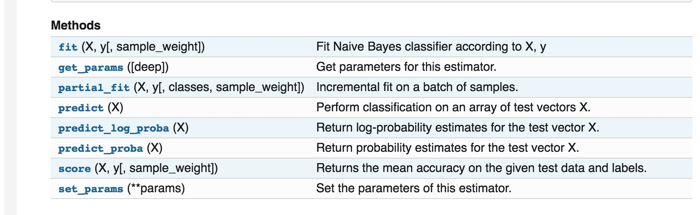

&#160; &#160; &#160; &#160;以前写过[一篇博文](https://ayonel.me/index.php/2016/08/12/weka_naivebayes/)是利用weka来实现多项式朴素贝叶斯增量学习。这次利用python中的sklearn学习工具来实现。其实个人感觉像机器学习，数据处理这种活本来就应该让我们高雅而优美的Python来实现，Java你瞎凑什么热闹啊~~ 
&#160; &#160; &#160; &#160;与weka的实现相比，sklearn果然还是继承了Python简洁优雅的传统，实现起来十分方便。如何判断sklearn中分类器是否支持增量学习(incremental learning & online learning)呢？很简单，只需要查阅[sklearn文档](http://scikit-learn.org/stable/modules/generated/sklearn.naive_bayes.MultinomialNB.html#sklearn.naive_bayes.MultinomialNB)，如果该分类器存在**partial_fit()**方法，即说明它支持增量学习。 比如我们的[多项式朴素贝叶斯](http://scikit-learn.org/stable/modules/generated/sklearn.naive_bayes.MultinomialNB.html#sklearn.naive_bayes.MultinomialNB)中就有该方法：
  下面我以一个十分简单的实例来进行演示： 比如我们有三份数据集，先用数据集1进行训练，然后预测数据集3；然后再利用数据集2再对模型进行更新，之后再预测数据集3。 
数据集1：**‘\[ \]’中代表样本向量， ‘#’后面代表样本标签** 
```
 [1 1 0 1 2 0 3 1 2 2]    # 1
 [0 3 1 1 2 2 1 3 2 1]    # 0
 [0 3 0 3 2 2 2 1 4 0]    # 0 
 [1 4 3 2 4 0 2 1 3 4]    # 1
 [4 4 3 4 0 3 4 2 4 4]    # 0
 [0 2 1 3 3 1 0 1 2 3]    # 1
```
数据集2：
```
 [0 1 2 2 2 1 0 0 2 3]    # 0
 [2 1 2 1 0 3 1 2 1 1]    # 1
 [4 0 3 3 3 4 2 2 4 2]    # 0
 [1 3 3 4 1 4 3 0 3 3]    # 1
 [1 4 4 0 3 4 0 2 2 2]    # 1
 [1 4 0 4 1 0 4 1 4 1]    # 1
```
数据集3（测试集，没有标签）：
```
 [1 4 1 3 0 3 1 2 3 4]
 [0 2 0 2 3 2 0 0 2 2]
 [0 3 4 3 0 1 4 4 4 2]
 [0 4 3 0 2 2 2 1 0 3]
 [4 3 1 3 3 2 2 0 0 1]
 [3 0 3 2 4 2 1 2 1 0]
```
 代码十分简单，先来看看吧： 
```
import numpy as np
#构造数据集，每份数据集是6*10的随机生成的矩阵，代表有6个样本，每个样本中有10个向量。
X1 = np.random.randint(5, size=(6, 10))#数据集1
X2 = np.random.randint(5, size=(6, 10))#数据集2
X3 = np.random.randint(5, size=(6, 10))#数据集3

#打印出3份数据集
print(X1)
print(X2)
print(X3)

y1 = np.array([1, 0, 0, 1, 0, 1])#数据集1中每份数据对应的标签
y2 = np.array([0, 1, 0, 1, 1, 1])#数据集2中每份数据对应的标签

#所有数据集中出现的分类标签
labels = np.array([0, 1])

from sklearn.naive_bayes import MultinomialNB
clf = MultinomialNB() #定义分类器

#先利用X1与y1进行部分训练
print('start tranning...')
clf.partial_fit(X1, y1, classes=labels)#核心方法，部分训练，第一次partial_fit,需要在classes参数中给出所有标签
print('第一次预测结果:'+str(clf.predict(X3[:]))) #打印出对数据集3的预测结果

#再利用X2与y2进行模型更新
clf.partial_fit(X2, y2)#
print('更新后预测结果:'+str(clf.predict(X3[:]))) #再打印出对数据集3的预测结果```
运行结果为：(由于数据集是随机生成的，所以每次的结果均会不同)

```
[[1 1 0 1 2 0 3 1 2 2]
 [0 3 1 1 2 2 1 3 2 1]
 [0 3 0 3 2 2 2 1 4 0]
 [1 4 3 2 4 0 2 1 3 4]
 [4 4 3 4 0 3 4 2 4 4]
 [0 2 1 3 3 1 0 1 2 3]]
[[0 1 2 2 2 1 0 0 2 3]
 [2 1 2 1 0 3 1 2 1 1]
 [4 0 3 3 3 4 2 2 4 2]
 [1 3 3 4 1 4 3 0 3 3]
 [1 4 4 0 3 4 0 2 2 2]
 [1 4 0 4 1 0 4 1 4 1]]
[[1 4 1 3 0 3 1 2 3 4]
 [0 2 0 2 3 2 0 0 2 2]
 [0 3 4 3 0 1 4 4 4 2]
 [0 4 3 0 2 2 2 1 0 3]
 [4 3 1 3 3 2 2 0 0 1]
 [3 0 3 2 4 2 1 2 1 0]]
start tranning...
第一次预测结果:[0 1 0 1 0 0]
更新后预测结果:[1 1 1 1 1 0]
```
最终的预测结果表示的是对数据集3中的6个样本，分别预测出的标签。 如果最终需要的结果不是预测出类别，而是需要每个类别精确的概率值。 可以采用方法[clf.predict_proba()](http://scikit-learn.org/stable/modules/generated/sklearn.naive_bayes.MultinomialNB.html#sklearn.naive_bayes.MultinomialNB.predict_proba)