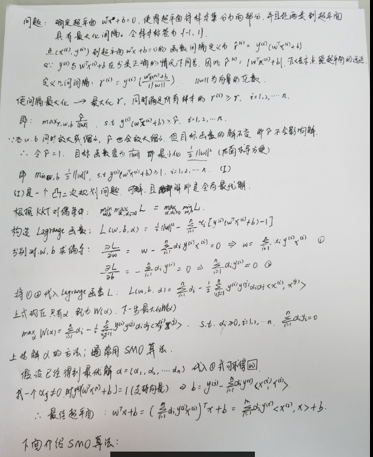
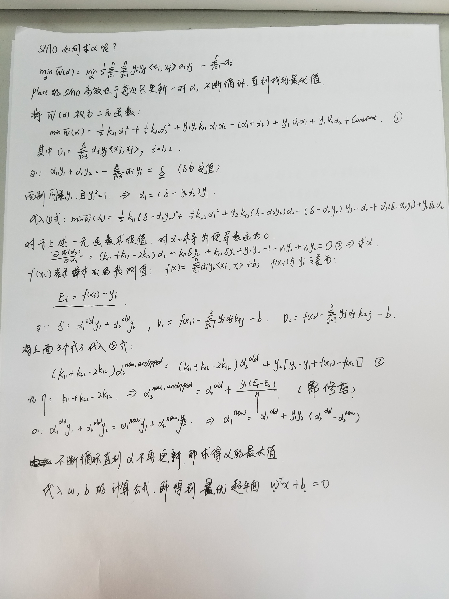

&#160; &#160; &#160; &#160;这两天仔细研究了一下SVM的底层数学原理，感觉大学基础数学没好好学，现在看起来真的很吃力啊~~ 
&#160; &#160; &#160; &#160;整理了几篇关于SVM原理的文章，大家有兴趣可以看看。
- jasper的[SVM入门教程](http://www.blogjava.net/zhenandaci/category/31868.html)，总共有9篇，作者文笔了得，深入浅出，将很复杂抽象的概念都能讲解的特别清楚，非常值得一看。
- July、pluskid的[支持向量机通俗导论（理解SVM的三层境界）](http://www.cnblogs.com/v-July-v/archive/2012/06/01/2539022.html)，讲得十分详细，很多细节都做了推导。 
- 勿在浮砂筑高台_的[【机器学习详解】SVM解二分类,多分类,及后验概率输出](http://blog.csdn.net/luoshixian099/article/details/51073885)以及[【机器学习详解】SMO算法剖析](http://blog.csdn.net/luoshixian099/article/details/51227754)

&#160; &#160; &#160; &#160;由于编辑公式很繁琐，我在纸上进行了推导。主要参考了_勿在浮砂筑高台_的推导过程！  