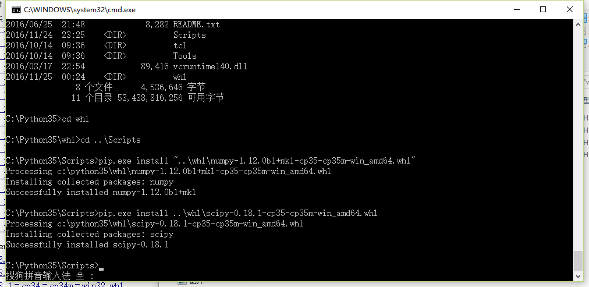

scipy是python下的一个数值计算工具包，sklearn依赖于这个包。当我调用sklearn的`CountVectorizer`时，提示没有发现包scipy，直接安装又总是失败。   

问题就在于 scipy的安装需要依赖很多别的包，在windows这个蛋疼的平台下极有可能安装失败。并且在windows上scipy的安装依赖于mkl+numpy这个包。这个包官方并没有提供，而在[http://www.lfd.uci.edu/~gohlke/pythonlibs/#scipy](http://www.lfd.uci.edu/~gohlke/pythonlibs/#scipy)这里面有提供。  

我的python是3.5,64位。 所以我选择`numpy-1.12.0b1+mkl-cp35-cp35m-win\_amd64.whl`和`scipy-0.18.1-cp35-cp35m-win\_amd64.whl`这两个文件。cp35代表python3.5,其他版本要选择其他对应的文件。下载好之后先用pip 安装numpy+mkl：
```
pip install numpy-1.12.0b1+mkl-cp35-cp35m-win_amd64.whl
```


再安装scipy： 
```
pip install scipy-0.18.1-cp35-cp35m-win_amd64.whl
```

大功告成。
 不过这个网址`http://www.lfd.uci.edu/~gohlke/pythonlibs/`是在国外，下载起来速度简直是龟速。我把我安装的这个两个文件已经上传到百度云了。另外还有32位的，有需要的同学可以自行下载。
分享链接：[http://pan.baidu.com/s/1miloOe0](http://pan.baidu.com/s/1miloOe0) 密码：**edo4**